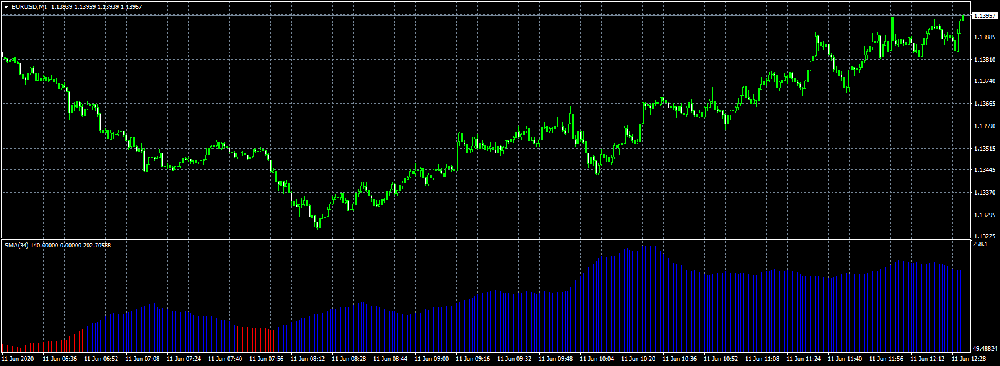
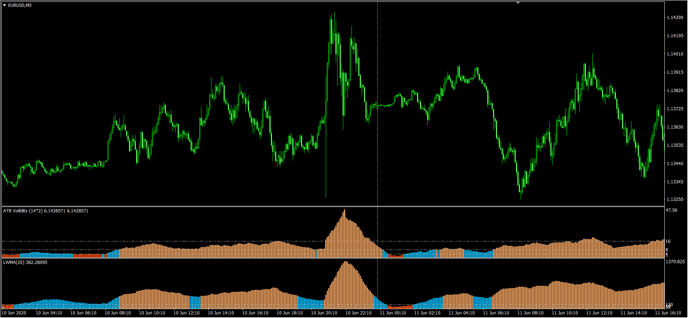

# volume-MA

> Source: https://fxcodebase.com/code/viewtopic.php?f=38&t=70003  
> Forum: 38 · Topic 70003 · 11 post(s)

---

## volume-MA

**Apprentice** · Thu Jun 11, 2020 6:22 am

Based on request.
[viewtopic.php?f=27&t=69969](https://fxcodebase.com/code/viewtopic.php?f=27&t=69969)

 [volume-MA.mq4](files/134836/volume-MA.mq4)

---

## Re: volume-MA

**richard19** · Thu Jun 11, 2020 10:57 am

Hi Mario,

Thank you for making this indicator. It is much easier to see the ATR and Volume data now.

Cheers
richard

---

## Re: volume-MA

**richard19** · Fri Jun 12, 2020 12:33 am

Hi Mario,

Thanks again for the volume MA colour.
As we can see, there is a certain degree of correlation between the ATR and Volume. I wish there is a way to normalize both and combine both into one single indicator. So, the unified indicator can serve as a baseline for strategies that look at volume and ATR.

Just an idea.. not sure if this works or makes any sense.

 

Cheers
richard

---

## Re: volume-MA

**Apprentice** · Sun Jun 14, 2020 7:29 pm

Your request is added to the development list.
Development reference 1482.

---

## Re: volume-MA

**Apprentice** · Tue Jun 16, 2020 5:45 am

I need rules for the indicator.
One indicator as a bar.
Second as Line.
Color coding that will include something like this
1 Up
2. Up
1. Down
2. Down.

---

## Re: volume-MA

**richard19** · Thu Jun 18, 2020 1:35 am

> **Apprentice wrote:**
> I need rules for the indicator.
> One indicator as a bar.
> Second as Line.
> Color coding that will include something like this
> 1 Up
> 2. Up
> 1. Down
> 2. Down.

HI Mario

That's a nice idea and thank you.

Can we have ATR as the bar but the vertical scale normalized to pip value?

The volume MA can be a line. But, not sure how we can show three different colours for the line.

Well, you have much better ideas for this so I go with your thoughts.

Cheers
richard

---

## Re: volume-MA

**Apprentice** · Thu Jun 18, 2020 5:18 am

Your request is added to the development list.
Development reference 1513.

---

## Re: volume-MA

**Apprentice** · Thu Jun 25, 2020 5:05 am

[volume-MA with ATR Volatility.mq4](files/135267/volume-MA%20with%20ATR%20Volatility.mq4)

Try this version.

---

## Re: volume-MA

**richard19** · Thu Jun 25, 2020 11:14 pm

> **Apprentice wrote:**
>
>
> The attachment **volume-MA with ATR Volatility.mq4** is no longer available
>
>
> Try this version.

HI Mario,

Thank you for the update.

Unfortunately, by default, it doesn't show the ATR value. Also, we lost the colour based levels too.

This is the default view;

 

This is the modified wit very large ATR multiplier

 

Hope you can normalize the ATR values to show pip values rather than point values. That way, we can then use the appropriate multiplier to correlate with volume.

Cheers
richard

---

## Re: volume-MA

**Apprentice** · Fri Jun 26, 2020 3:42 am

Your request is added to the development list.
Development reference 1565.

---

## Re: volume-MA

**Apprentice** · Fri Jun 26, 2020 4:56 am

[volume-MA with ATR Volatility v1.1.mq4](files/135326/volume-MA%20with%20ATR%20Volatility%20v1.1.mq4)

Try this version.
