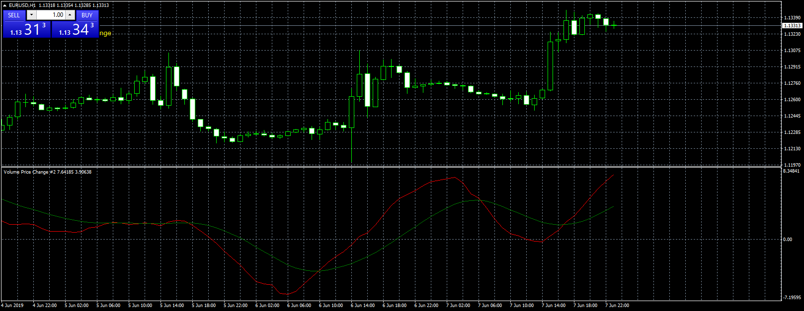

# Volume Price Change

> Source: https://fxcodebase.com/code/viewtopic.php?f=38&t=68550  
> Forum: 38 · Topic 68550 · 2 post(s)

---

## Volume Price Change

**Apprentice** · Sat Jun 08, 2019 2:37 am

Based on TS2/Lua
[viewtopic.php?f=17&t=65729&start=10](https://fxcodebase.com/code/viewtopic.php?f=17&t=65729&start=10)

 [Volume Price Change.mq4](files/126787/Volume%20Price%20Change.mq4)

---

## Re: Volume Price Change

**clavez** · Thu May 21, 2020 5:19 am

it's very good, thank you.

I added symbol in my version to be more understandable if you run it on many charts

Code: [Select all](https://fxcodebase.com/code/)
`{
         signaler.SendNotifications(_Symbol + " - Line/Overbought. Cross Under");
         last_signal = Time[0];
      }`
