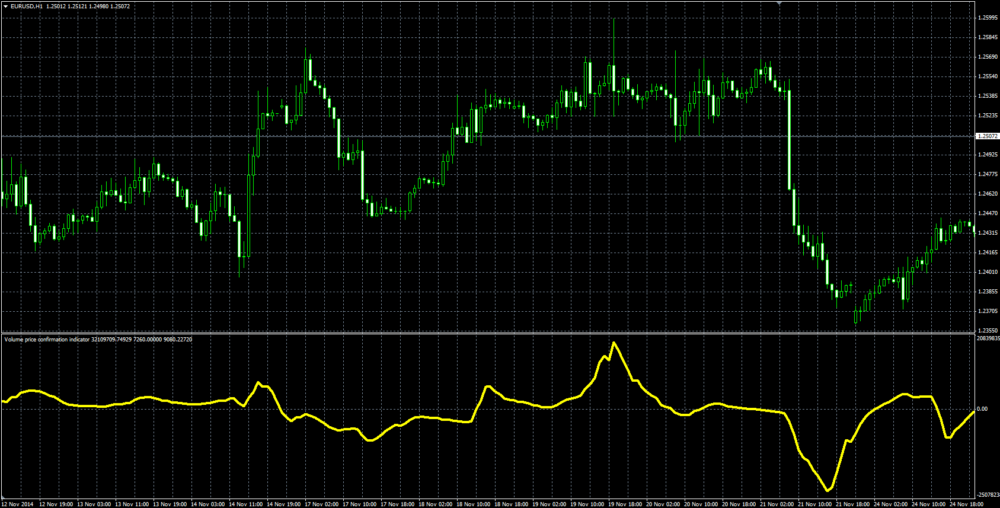

# Volume price confirmation indicator (VPCI)

> Source: https://fxcodebase.com/code/viewtopic.php?f=38&t=61609  
> Forum: 38 · Topic 61609 · 6 post(s)

---

## Volume price confirmation indicator (VPCI)

**Alexander.Gettinger** · Fri Dec 19, 2014 12:23 pm

The VPCI finds the relation between price and volume.

Formulas:
VPCI = VPC*VPR*VM, where
VPC = VWMA(Slow_period)-SMA(Slow_period),
VWMA = Sum(Price_close*Volume),
SMA = Sum(Price_close),
VPR = VWMA(Fast_period)/SMA(Fast_period),
VM = (Sum(Volume,Fast_period)*Slow_period)/(Sum(Volume,Slow_period)*Fast_period).

 

Download:

 [VPCI.mq4](files/97776/VPCI.mq4)

 [vpci_BB.mq4](files/97776/vpci_BB.mq4)

Based on Lua/TS2 version.
[viewtopic.php?f=17&t=3478](https://fxcodebase.com/code/viewtopic.php?f=17&t=3478)

---

## Re: Volume price confirmation indicator (VPCI)

**logicgate** · Thu Jan 03, 2019 8:25 pm

Thanks!!!

---

## Re: Volume price confirmation indicator (VPCI)

**logicgate** · Fri Aug 16, 2019 7:20 pm

Hi there my friend. Can you add a Bollinger band option inside the indicator to be plotted around the indicator (VPCI) using the indicator data? I am trying to apply indicators to indicators in MT4 following the instructions I found online, but it ends up adding to main price chart always... Check the screenshot, I choose to apply to indicator but does not work.

---

## Re: Volume price confirmation indicator (VPCI)

**Apprentice** · Sun Aug 18, 2019 8:23 am

Your request is added to the development list under Id Number 4852

---

## Re: Volume price confirmation indicator (VPCI)

**logicgate** · Sun Aug 18, 2019 9:10 am

My friend you can abort this request, i don´t wanna waste your time. I was able just now to apply the bollinger bands to the indicator, the thing i was not doing was dragging the indicator on TOP of the indicator.... It does not work if you double click the indicator on the list and choose from the dropdown menu.

---

## Re: Volume price confirmation indicator (VPCI)

**Apprentice** · Mon Aug 19, 2019 6:34 am

vpci_BB.mq4 added.
