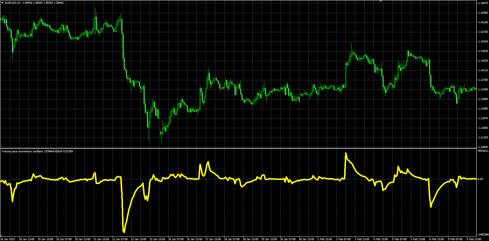

# Volume Price Momentum Oscillator

> Source: https://fxcodebase.com/code/viewtopic.php?f=38&t=62089  
> Forum: 38 · Topic 62089 · 1 post(s)

---

## Volume Price Momentum Oscillator

**Alexander.Gettinger** · Wed Apr 08, 2015 11:32 am

Original LUA oscillator: [viewtopic.php?f=17&t=61222](https://fxcodebase.com/code/viewtopic.php?f=17&t=61222).

Formula:
VPMO = EMA(vpm) with [Length] number of periods, where
vpm[i] = Volume[i]*(Close[i]-Close[i-1]).

 

Download:

 [Volume_Price_Momentum_Oscillator.mq4](files/99686/Volume_Price_Momentum_Oscillator.mq4)
