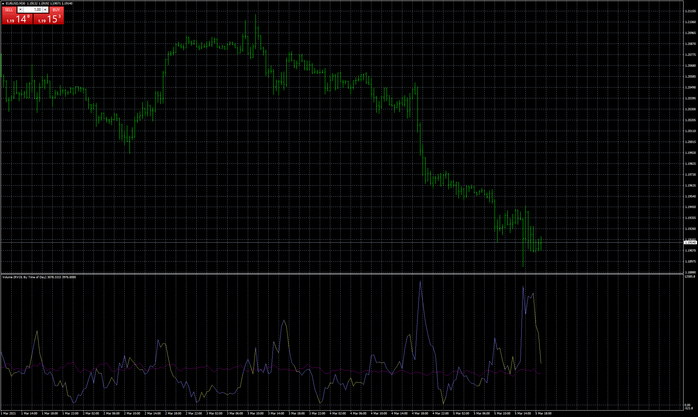

# Volume (RVOL By Time of Day)

> Source: https://fxcodebase.com/code/viewtopic.php?f=38&t=70976  
> Forum: 38 · Topic 70976 · 3 post(s)

---

## Volume (RVOL By Time of Day)

**Apprentice** · Fri Mar 05, 2021 12:21 pm

Based on the request.
[viewtopic.php?f=27&t=70918](https://fxcodebase.com/code/viewtopic.php?f=27&t=70918)

 [Volume (RVOL By Time of Day).mq4](files/141072/Volume%20%28RVOL%20By%20Time%20of%20Day%29.mq4)

---

## Re: Volume (RVOL By Time of Day)

**MarketMage** · Fri Mar 05, 2021 12:41 pm

thank you!!!

---

## Re: Volume (RVOL By Time of Day)

**MarketMage** · Mon Mar 08, 2021 11:59 pm

non functional for me.
default settings, let it run all day on EURUSD 30M.
subwindow stays empty

screenshot attached
