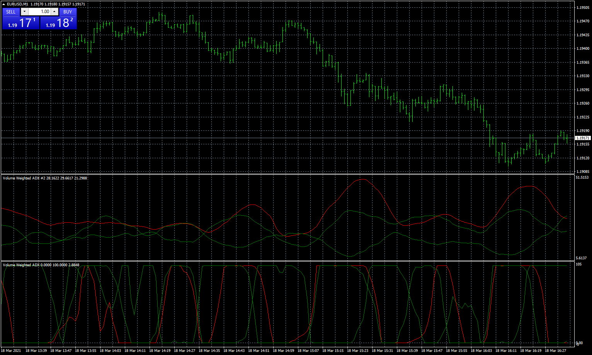
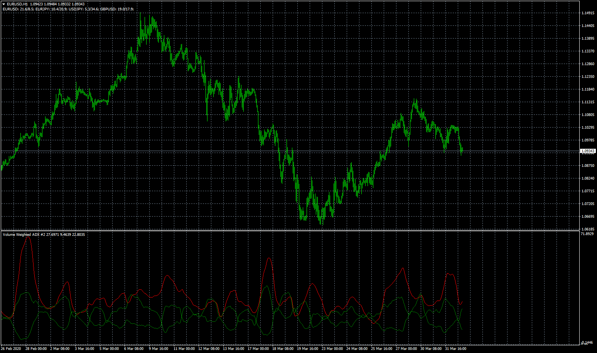

# Volume Weighted ADX

> Source: https://fxcodebase.com/code/viewtopic.php?f=38&t=69604  
> Forum: 38 · Topic 69604 · 4 post(s)

---

## Volume Weighted ADX

**Apprentice** · Wed Apr 01, 2020 8:37 am

Based on request.
[viewtopic.php?f=38&t=69596](https://fxcodebase.com/code/viewtopic.php?f=38&t=69596)

 [Volume Weighted ADX.mq4](files/132471/Volume%20Weighted%20ADX.mq4)

 

 [Normalized Volume Weighted ADX.mq4](files/132471/Normalized%20Volume%20Weighted%20ADX.mq4)

---

## Re: Volume Weighted ADX

**alienfriend18** · Wed Mar 17, 2021 6:41 am

Need Normalized version of Volume weighted ADX indicator with the additional option-
1. Normalized
2.Multipair option

---

## Re: Volume Weighted ADX

**Apprentice** · Wed Mar 17, 2021 1:34 pm

Your request is added to the development list.
Development reference 290.

---

## Re: Volume Weighted ADX

**Apprentice** · Thu Mar 18, 2021 8:35 am

Normalized Volume Weighted ADX.mq4 added.
