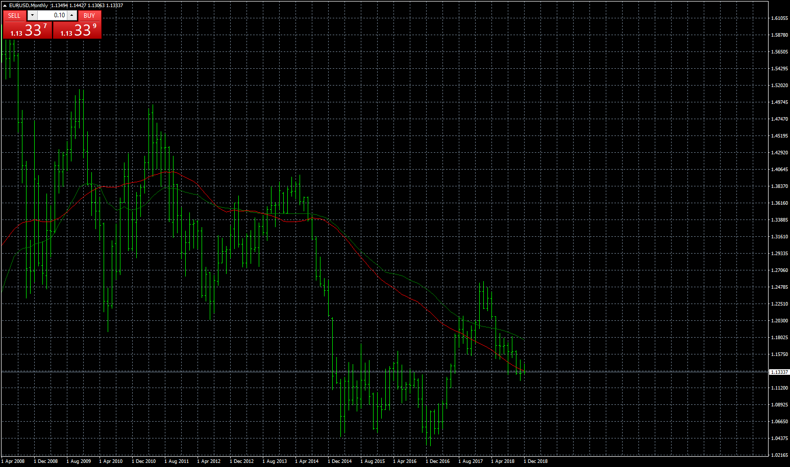

# Volume Weighted Moving Average

> Source: https://fxcodebase.com/code/viewtopic.php?f=38&t=67144  
> Forum: 38 · Topic 67144 · 19 post(s)

---

## Volume Weighted Moving Average

**Apprentice** · Wed Dec 12, 2018 7:21 am

Based on lua version.
[viewtopic.php?f=17&t=64554](https://fxcodebase.com/code/viewtopic.php?f=17&t=64554)

 [Volume Weighted Moving Average.mq4](files/122711/Volume%20Weighted%20Moving%20Average.mq4)

 [Smoothed Volume Weighted Moving Average.mq4](files/122711/Smoothed%20Volume%20Weighted%20Moving%20Average.mq4)

---

## Re: Volume Weighted Moving Average

**Apprentice** · Wed Jan 02, 2019 6:48 am

Smoothed Volume Weighted Moving Average added.

---

## Re: Volume Weighted Moving Average

**logicgate** · Sat Mar 09, 2019 5:18 pm

Dear friend,

Can you add a "displacement'" option on those two indicators?

It will displace the averages to the right by "N" amount of bars in the **time axis**.

Thanks

---

## Re: Volume Weighted Moving Average

**Apprentice** · Sun Mar 10, 2019 5:54 am

Your request is added to the development list under Id Number 4526

---

## Re: Volume Weighted Moving Average

**Alexander.Gettinger** · Mon Mar 11, 2019 9:09 pm

Please try this indicators:

 [Volume Weighted Moving Average D.mq4](files/124369/Volume%20Weighted%20Moving%20Average%20D.mq4)

 [Smoothed Volume Weighted Moving Average D.mq4](files/124369/Smoothed%20Volume%20Weighted%20Moving%20Average%20D.mq4)

---

## Re: Volume Weighted Moving Average

**logicgate** · Tue Mar 12, 2019 7:06 am

Thanks my friend!

---

## Re: Volume Weighted Moving Average

**wb2010** · Wed Dec 18, 2019 5:04 am

Would it please be possible to have the Volume Weighted Moving Average.mq4 as a histogram? Thank you.

---

## Re: Volume Weighted Moving Average

**Apprentice** · Wed Dec 18, 2019 4:26 pm

Your request is added to the development list.
Development reference 449.

---

## Re: Volume Weighted Moving Average

**Apprentice** · Thu Dec 19, 2019 11:44 am

I don't understand how it should look like?
I see no points in showing it in the current version as a histogram

---

## Re: Volume Weighted Moving Average

**wb2010** · Mon Dec 23, 2019 8:13 am

I use it as a two line cross only. Sometimes it is hard for me to see which one is on top at the moment.thats why I was wondering if it is possible to have it as a histogram. I hope this makes sense.

---

## Re: Volume Weighted Moving Average

**Apprentice** · Wed Dec 25, 2019 5:41 am

[Volume_Weighted_Moving_Average_Histogram.mq4](files/130452/Volume_Weighted_Moving_Average_Histogram.mq4)

Try this version.

---

## Re: Volume Weighted Moving Average

**durlovjagiroad** · Sat Jan 11, 2020 1:13 am

Want Vwap with the option to use Previous indicator as close price.

---

## Re: Volume Weighted Moving Average

**Apprentice** · Sat Jan 11, 2020 7:10 am

Your request is added to the development list.
Development reference 537.

---

## Re: Volume Weighted Moving Average

**Apprentice** · Mon Jan 13, 2020 6:09 am

I don't understand what needs to be done
If the option is on.
Will delay the output by one candle?

---

## Re: Volume Weighted Moving Average

**durlovjagiroad** · Mon Jan 13, 2020 10:00 am

Just like moving average.. apply to ..option should have previous indicator data or first indicator data option

---

## Re: Volume Weighted Moving Average

**Apprentice** · Sat Jan 18, 2020 5:50 am

Such a feature exists in FXTS2 only.
We can do this on a case by case base.
You will have to define a specific indicator to implement it with.

---

## Re: Volume Weighted Moving Average

**durlovjagiroad** · Sat Jan 18, 2020 7:54 am

If possible with volume flow indicator and RSI

---

## Re: Volume Weighted Moving Average

**Apprentice** · Sun Jan 19, 2020 5:08 am

Your request is added to the development list.
Development reference 562.

---

## Re: Volume Weighted Moving Average

**Apprentice** · Wed Jan 22, 2020 5:22 pm

[RSI Volume Weighted Moving Average.mq4](files/130857/RSI%20Volume%20Weighted%20Moving%20Average.mq4)

 [RSI Volume_Weighted_Moving_Average_Histogram.mq4](files/130857/RSI%20Volume_Weighted_Moving_Average_Histogram.mq4)

Something like this?
