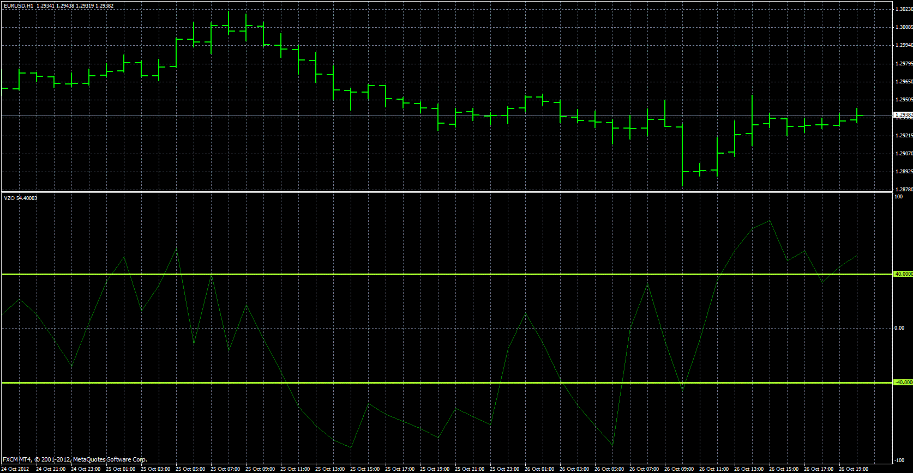

# VOLUME ZONE OSCILLATOR

> Source: https://fxcodebase.com/code/viewtopic.php?f=38&t=25075  
> Forum: 38 · Topic 25075 · 21 post(s)

---

## VOLUME ZONE OSCILLATOR

**Apprentice** · Sun Oct 28, 2012 8:36 am

Based on TS2/Lua version.
[viewtopic.php?f=17&t=22397](https://fxcodebase.com/code/viewtopic.php?f=17&t=22397)
In his book Technical Analysis Of The Financial Markets, John J. Murphy explains that using oscillators provides three benefits:
Overbought and oversold conditions warn that the price trend is overextended and vulnerable.
The divergence between oscillator and price action shows hidden strength or weakness in the market, which is not apparent in the price action.
The crossing of the zero line can give an important trading signal.
The formula depends on only one condition: If today’s closing price is higher than yesterday’s, then the volume will have a positive value (bullish). Otherwise, it will have a negative value

 [VZO.MQ4](files/43089/VZO.MQ4)

 [VZO Signal Line.MQ4](files/43089/VZO%20Signal%20Line.MQ4)

 [VZO.mq5](files/43089/VZO.mq5)

---

## Re: VOLUME ZONE OSCILLATOR

**juju1024** · Sun Oct 28, 2012 9:43 am

Thank you very much

---

## Re: VOLUME ZONE OSCILLATOR

**Apprentice** · Tue Dec 11, 2012 11:23 am

Updated.

---

## Re: VOLUME ZONE OSCILLATOR

**Apprentice** · Sat Jun 18, 2016 5:04 pm

Update.

---

## Re: VOLUME ZONE OSCILLATOR

**Apprentice** · Wed Jan 02, 2019 5:50 am

VZO Signal Line.MQ4 added.

---

## Re: VOLUME ZONE OSCILLATOR

**alienfriend18** · Sat Mar 14, 2020 11:47 am

Not working

---

## Re: VOLUME ZONE OSCILLATOR

**alienfriend18** · Sat Mar 14, 2020 12:50 pm

Sorry, please ignore the early post. solved

---

## Re: VOLUME ZONE OSCILLATOR

**logicgate** · Tue Jul 20, 2021 7:02 am

Hi there buddy, can we get a MT5 version of this indicator?

Thanks

---

## Re: VOLUME ZONE OSCILLATOR

**Apprentice** · Wed Jul 21, 2021 12:18 am

Your request is added to the development list.
Development reference 669.

---

## Re: VOLUME ZONE OSCILLATOR

**Apprentice** · Thu Jul 22, 2021 10:02 am

VZO.mq5 added.

---

## Re: VOLUME ZONE OSCILLATOR

**logicgate** · Tue Jul 27, 2021 10:42 am

Thanks buddy!!!

I will thank you here for all MT5 additions instead of posting "thanks" in every single thread.

Best regards!

---

## Re: VOLUME ZONE OSCILLATOR

**durlovjagiroad** · Wed Nov 10, 2021 7:47 am

require Multi symbol VZO indicator for mt4...thanks

---

## Re: VOLUME ZONE OSCILLATOR

**Apprentice** · Thu Nov 11, 2021 3:54 am

Your request is added to the development list.
Development reference 981.

---

## Re: VOLUME ZONE OSCILLATOR

**nnbite** · Sat Dec 25, 2021 12:55 pm

hi ,Can you create an ea for us? ...thx bro

---

## Re: VOLUME ZONE OSCILLATOR

**nnbite** · Sat Dec 25, 2021 1:05 pm

Can you create an ea from this indicator for us? ... thx

---

## Re: VOLUME ZONE OSCILLATOR

**Apprentice** · Sun Dec 26, 2021 4:59 am

Can you define the EA rules?

---

## Re: VOLUME ZONE OSCILLATOR

**nnbite** · Sun Dec 26, 2021 9:48 am

> **Apprentice wrote:**
> Can you define the EA rules?

I think that
Buy when vzo turns white to green and close when it turns white. ,Sell when white turns red and close when turns white.

I tried to build it myself but it didn't work. I understand that buffer exists. did not separate the colors

Sorry for using my language. I use google translate
thank you

---

## Re: VOLUME ZONE OSCILLATOR

**Apprentice** · Sun Dec 26, 2021 9:52 am

Your request is added to the development list.
Development reference 1032.

---

## Re: VOLUME ZONE OSCILLATOR

**Apprentice** · Thu Dec 30, 2021 6:29 am

Try this version.
[https://fxcodebase.com/code/viewtopic.php?f=38&t=71748](https://fxcodebase.com/code/viewtopic.php?f=38&t=71748)

---

## Re: VOLUME ZONE OSCILLATOR

**nnbite** · Sat Jan 01, 2022 7:20 pm

Thx bro

---

## Re: VOLUME ZONE OSCILLATOR

**Apprentice** · Wed Feb 05, 2025 3:14 pm

 [VZO.mq4](files/158129/VZO.mq4)
