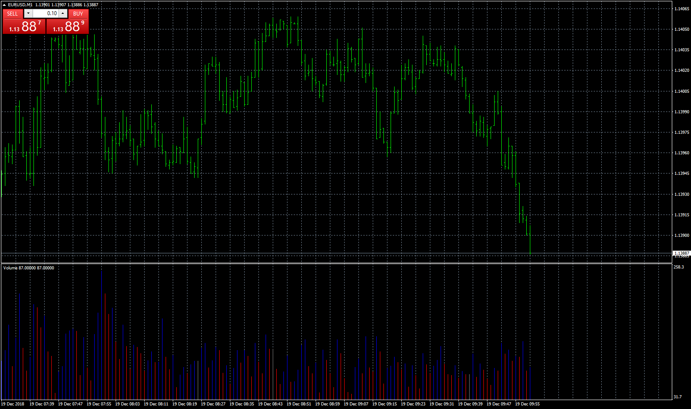

# Volume

> Source: https://fxcodebase.com/code/viewtopic.php?f=38&t=67181  
> Forum: 38 · Topic 67181 · 8 post(s)

---

## Volume

**Apprentice** · Wed Dec 19, 2018 6:56 am

Based on request.
[viewtopic.php?f=27&p=122945](https://fxcodebase.com/code/viewtopic.php?f=27&p=122945)
Colors volume bars if volume is higher/lower then previus two bars.

 [Low High Volume.mq4](files/122948/Low%20High%20Volume.mq4)

Simple up/down volume.
Colors volume bars if volume is higher/lower then previus bars.

 [Volume.mq4](files/122948/Volume.mq4)

 [Low High Volume Continuation.mq4](files/122948/Low%20High%20Volume%20Continuation.mq4)

---

## Re: Volume

**logicgate** · Wed Dec 19, 2018 12:35 pm

Hello dear friend apprentice.

I haven't downloaded the indi yet, but from the description I think you haven't got it right.

Let's say that the default volume color is blue. Then you have a bar that has lower volume than the previous two bars, it gets painted pink. If the next bar is higher than this pink bar, it gets painted blue, it does not need to have higher volume than previous two.

If the next bar after the pink has even lower volume, it still gets painted pink, until a higher volume bar gets painted blue.

---

## Re: Volume

**Apprentice** · Thu Dec 20, 2018 2:41 pm

Low High Volume Continuation added.
If you will NOT use Higher segment,
change the High Blue color to Neutral Grey.

---

## Re: Volume

**logicgate** · Thu Dec 20, 2018 3:45 pm

> **Apprentice wrote:**
> Low High Volume Continuation added.
> If you will NOT use Higher segment,
> change the High Blue color to Neutral Grey.

Excellent, thanks so much my friend. God Bless!

---

## Re: Volume

**logicgate** · Sat Sep 21, 2019 3:55 pm

Dear friend Apprentice, can you please code a version of this indicator where the coloring of the volume histogram is based on bar close?

For example:

if the bar closes **above**the previous bar close, volume histogram will be one color

if the bar closes **below**the previous bar close, volume histogram will be another color

So the criteria of histogram coloring is only the closes.

Thanks!

---

## Re: Volume

**Apprentice** · Mon Sep 23, 2019 5:51 am

Your request is added to the development list.
Development reference 113.

---

## Re: Volume

**Apprentice** · Mon Sep 30, 2019 6:36 am

[Volume_color_on_close.mq4](files/128909/Volume_color_on_close.mq4)

Try this version.

---

## Re: Volume

**logicgate** · Tue Oct 01, 2019 8:41 am

Thx my friend, gonna test it right now.
