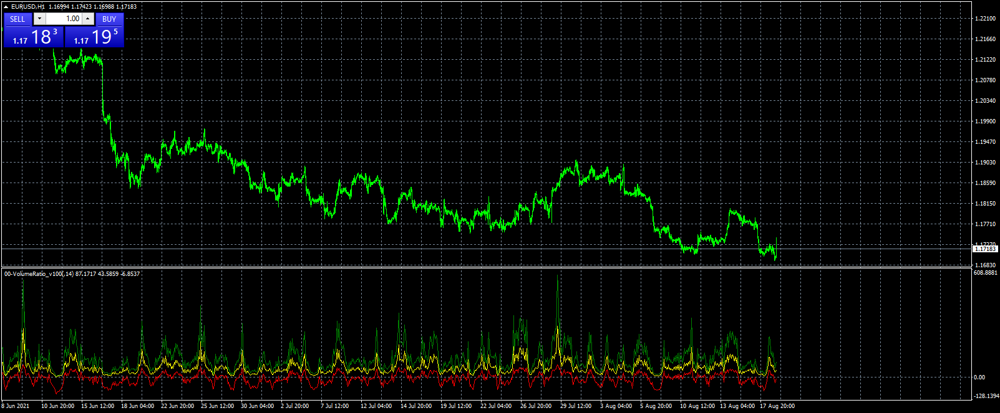
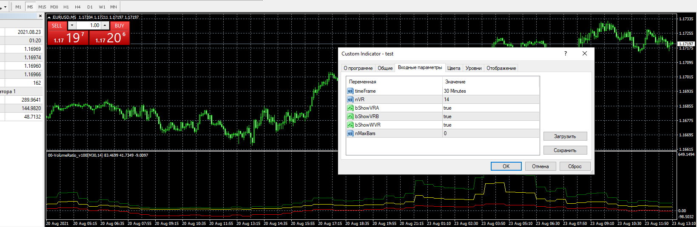

# VolumeRatio

> Source: https://fxcodebase.com/code/viewtopic.php?f=38&t=71429  
> Forum: 38 · Topic 71429 · 5 post(s)

---

## VolumeRatio

**Apprentice** · Wed Aug 18, 2021 1:26 pm

Based on the request.
[https://fxcodebase.com/code/viewtopic.p ... 58#p143258](https://fxcodebase.com/code/viewtopic.php?f=27&t=71415&p=143258#p143258)

 [VolumeRatio.mq4](files/143259/VolumeRatio.mq4)

---

## Re: VolumeRatio

**mouakkit.latifa** · Thu Aug 19, 2021 6:09 am

check the picture please not working
thank you

---

## Re: VolumeRatio

**mouakkit.latifa** · Thu Aug 19, 2021 9:06 am

check the picture please
the indicator not working
exemple chart 5M time frame ....and indicatot 30M....NOT working
thank you

---

## Re: VolumeRatio

**Apprentice** · Thu Aug 19, 2021 12:18 pm

Your request is added to the development list.
Development reference 757.

---

## Re: VolumeRatio

**Apprentice** · Tue Aug 24, 2021 2:55 am

I still don't have any issues.
You can use "number of bars" to limit processed history size

 

