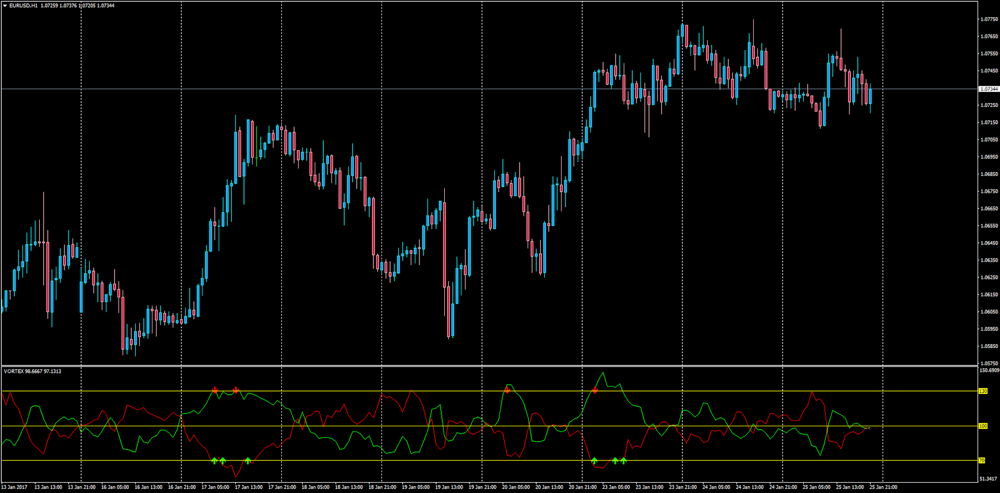

# Vortex Indicator with Signals and Alerts

> Source: https://fxcodebase.com/code/viewtopic.php?f=38&t=64350  
> Forum: 38 · Topic 64350 · 1 post(s)

---

## Vortex Indicator with Signals and Alerts

**Apprentice** · Fri Jan 27, 2017 6:48 am

LUA Original: [viewtopic.php?f=17&t=277](https://fxcodebase.com/code/viewtopic.php?f=17&t=277)

Description:

This has been an adaptation of the LUA Vortex that also displays signals and alerts for the current bar.

The Vortex indicator uses the relationship between today's high and yesterday's low for VM+ (similar to DMI+) and today's low and yesterday's high for VM- (similar to DMI-). The indicator plots only two lines.

In this MT4 adaptation the signals take into consideration the OB/OS levels. Since both VM+ and VM- are calculated using absolute values both signals could be considered for the two scenarios, giving 4 types of signals that can be turned on and off.

 [VORTEX.mq4](files/110741/VORTEX.mq4)
