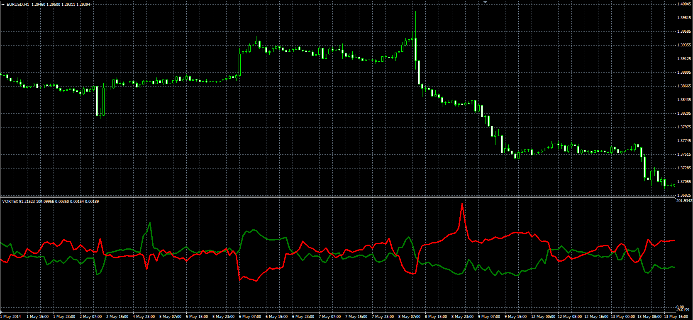

# Vortex Indicator

> Source: https://fxcodebase.com/code/viewtopic.php?f=38&t=61152  
> Forum: 38 · Topic 61152 · 1 post(s)

---

## Vortex Indicator

**Alexander.Gettinger** · Mon Sep 15, 2014 12:22 pm

Original LUA indicator: [viewtopic.php?f=17&t=277](https://fxcodebase.com/code/viewtopic.php?f=17&t=277).

Formulas:
VIP = 100*svip/satr,
VIM = 100*svim/satr, where
svip = MVA(iVIP),
svim = MVA(iVIM),
satr = MVA(ATR),
iVIP[i] = Abs(High[i]-Low[i-1]),
iVIM[i] = Abs(Low[i]-High[i-1]),
Abs - absolute value.

 

Download:

 [VORTEX.mq4](files/95901/VORTEX.mq4)
