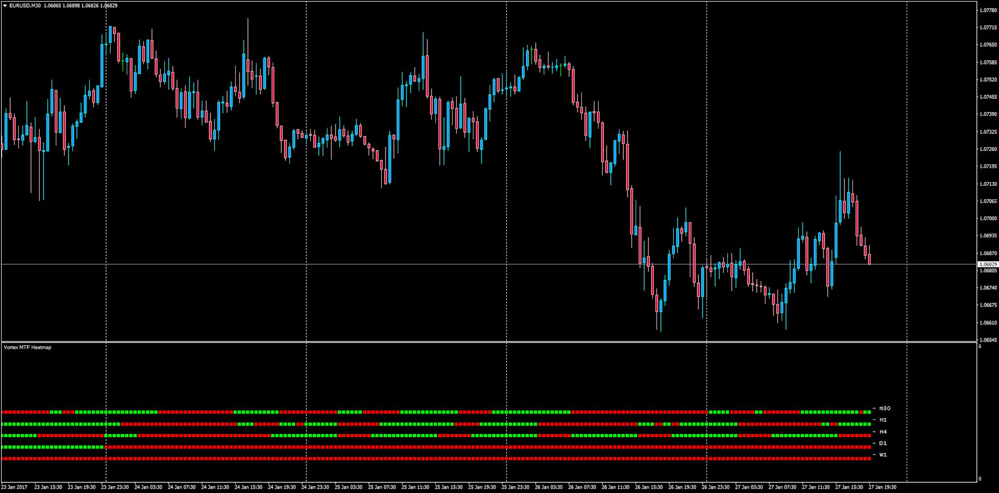

# Vortex Multi Time Frame Heatmap

> Source: https://fxcodebase.com/code/viewtopic.php?f=38&t=64362  
> Forum: 38 · Topic 64362 · 1 post(s)

---

## Vortex Multi Time Frame Heatmap

**Apprentice** · Sat Jan 28, 2017 8:05 am

Vortex Multi Time Frame Heatmap

LUA Original: [viewtopic.php?f=17&t=277](https://fxcodebase.com/code/viewtopic.php?f=17&t=277)

Description:

This indicator will display the status of the Vortex across the distinct time frames analyzed within a determined currency pair.

- If the Vortex VM+ is above 100 it will show green
- If the Vortex VM- is above 100 it will show red

 [Vortex_MTF_Heatmap.mq4](files/110757/Vortex_MTF_Heatmap.mq4)
