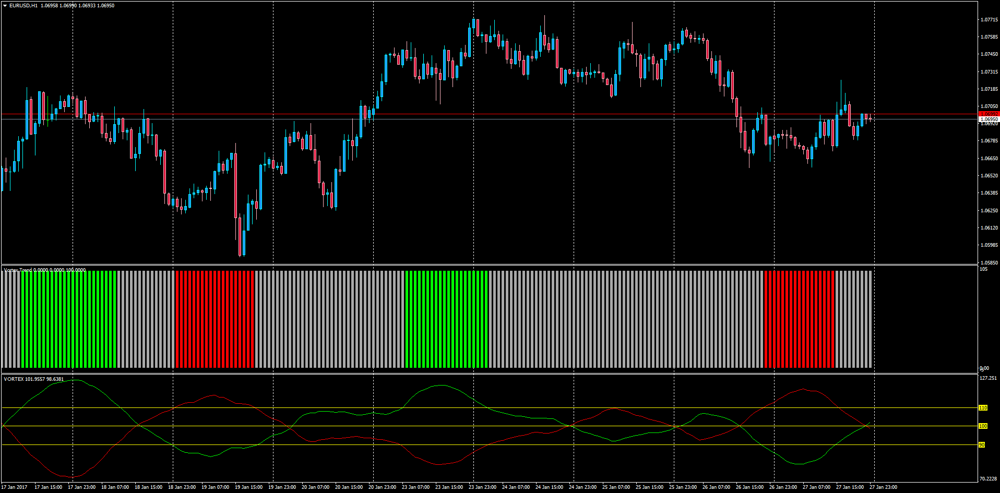

# Vortex Trend + Moving Averange of Vortex

> Source: https://fxcodebase.com/code/viewtopic.php?f=38&t=64364  
> Forum: 38 · Topic 64364 · 1 post(s)

---

## Vortex Trend + Moving Averange of Vortex

**Apprentice** · Sat Jan 28, 2017 4:51 pm

LUA Original: [viewtopic.php?f=17&t=2857](https://fxcodebase.com/code/viewtopic.php?f=17&t=2857)

Description:

Histrogram showing Up, Down and Neutral status on each bar when the Moving Average of Upper and Lower Vortex are above and below the OB/OS levels.

Up Trend

When Moving Average of Upper Vortext(20) is Greater than 110 (default) AND
When Moving Average of Lower Vortext(20) is Less than 90 (default)

Down Trend

When Moving Average of Lower Vortext(20) is Greater than 110 (default) AND
When Moving Average of Upper Vortext(20) is Less than 90 (default)

Also included the Vortex_MA.mq4 indicator to visualize the Vortex oscillator that produces the colors of the histogram.

 [VORTEX_MA.mq4](files/110773/VORTEX_MA.mq4)

 [Vortex_Trend.mq4](files/110773/Vortex_Trend.mq4)
