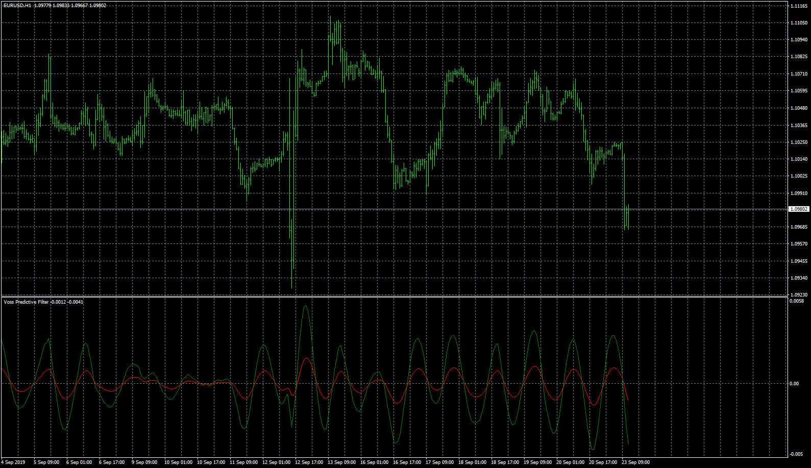

# Voss_Predictive_Filter

> Source: https://fxcodebase.com/code/viewtopic.php?f=38&t=68983  
> Forum: 38 · Topic 68983 · 5 post(s)

---

## Voss_Predictive_Filter

**Apprentice** · Fri Oct 04, 2019 5:58 am

TS2/Lua version.
[viewtopic.php?f=17&t=68660](https://fxcodebase.com/code/viewtopic.php?f=17&t=68660)

 [Voss_Predictive_Filter.mq4](files/129010/Voss_Predictive_Filter.mq4)

 [Voss_Predictive_Filter.mq5](files/129010/Voss_Predictive_Filter.mq5)

---

## Re: Voss_Predictive_Filter

**RummanC** · Tue Feb 25, 2020 9:00 am

Hi Apprentice,

I believe there is a bug in the MT5 version? Retrospective visuals are fine, but when running the indicator, i think there is some miscalculation? I have attached an image to display what happens

Beginning of strategy tester:

 

*Beginning of Strategy Tester*

After running for a few days:

 

*After several days on strategy tester*

I have attached an attempt to fix. Pos index changed from prev_calculated-> prev_calculated-1.
Thanks in advance for any help on the fix.

Kind regards
R

---

## Re: Voss_Predictive_Filter

**Apprentice** · Tue Feb 25, 2020 10:03 am

Your request is added to the development list.
Development reference 780.

---

## Re: Voss_Predictive_Filter

**Apprentice** · Wed Feb 26, 2020 5:30 am

Try it now.

---

## Re: Voss_Predictive_Filter

**RummanC** · Wed Feb 26, 2020 8:41 am

All working - thanks again!
