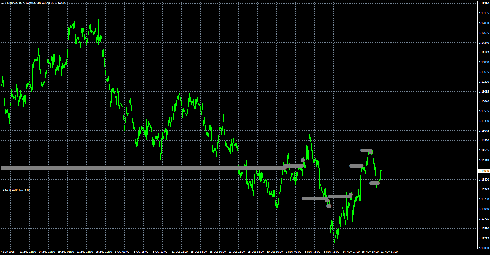
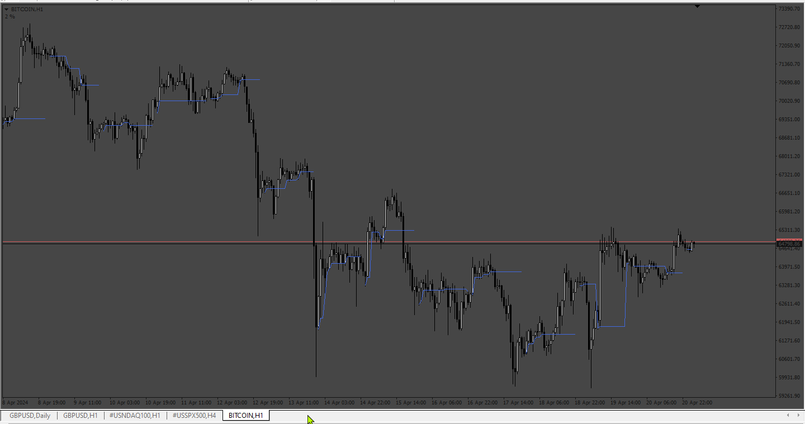

# VPOC

> Source: https://fxcodebase.com/code/viewtopic.php?f=38&t=66947  
> Forum: 38 · Topic 66947 · 13 post(s)

---

## VPOC

**Apprentice** · Wed Nov 21, 2018 8:58 am

Based on lua version.
[viewtopic.php?f=17&t=2640](https://fxcodebase.com/code/viewtopic.php?f=17&t=2640)

 [VPOC.mq4](files/122231/VPOC.mq4)

---

## Re: VPOC

**durlovjagiroad** · Tue May 05, 2020 11:24 pm

want dynamic poc line like mode like the image attached

---

## Re: VPOC

**Apprentice** · Wed May 06, 2020 4:18 am

Can you provide the MQ4 code or description?

---

## Re: VPOC

**durlovjagiroad** · Thu May 07, 2020 10:51 am

> **Apprentice wrote:**
> Can you provide the MQ4 code or description?

Something like this-
[https://www.mql5.com/en/market/product/39414](https://www.mql5.com/en/market/product/39414)

---

## Re: VPOC

**Apprentice** · Fri May 08, 2020 5:29 am

Your request is added to the development list.
Development reference 1250.

---

## Re: VPOC

**Apprentice** · Fri May 15, 2020 7:44 am

There is no code or formula. It's unknown how it should be calculated.

---

## Re: VPOC

**dmyy2k** · Sun Nov 22, 2020 4:09 am

Hi Apprentice, would love to see your POC being plot as Moving average POC.

With your current POC of existing time frame, would it be possible to have it as average POC accordingly and plot just like e.g. moving average of closing price(replace with POC?)

The indicator uses the historical data of the lower (relative to the current) timeframes for calculations:

M1 - for timeframes up to H1,
M5 - for timeframe H1,
M15 - for timeframe H4,
H1 - for timeframe D1,
H4 - for timeframe W1,
D1 - for timeframe MN.

[https://www.mql5.com/en/market/product/ ... escription](https://www.mql5.com/en/market/product/39414#description)

Thank you in advance
/Dmy

---

## Re: VPOC

**Apprentice** · Sun Nov 22, 2020 4:51 am

Your request is added to the development list.
Development reference 2343.

---

## Re: VPOC

**Apprentice** · Sun Nov 22, 2020 5:56 pm

[Dynamic VPOC.mq4](files/139076/Dynamic%20VPOC.mq4)

Try this version.

---

## Re: VPOC MT4 not responding in BTCUSD

**Domikov** · Sun Apr 14, 2024 1:41 am

VPOC & Dynamic VPOC not working in BTCUSD or others cripto symbols, CPU in overload and MT4 not responding... Why?

Thanks,
Domikov

---

## Re: VPOC

**Apprentice** · Sun Apr 14, 2024 10:55 am

We have added your request to the development list.
Development reference 308

---

## Re: VPOC

**Domikov** · Wed Apr 17, 2024 1:14 am

> **Apprentice wrote:**
> We have added your request to the development list.
> Development reference 308

Very thanks

---

## Re: VPOC

**Apprentice** · Mon Apr 22, 2024 10:02 am

 [Dynamic_VPOC_v2.mq4](files/155078/Dynamic_VPOC_v2.mq4)
