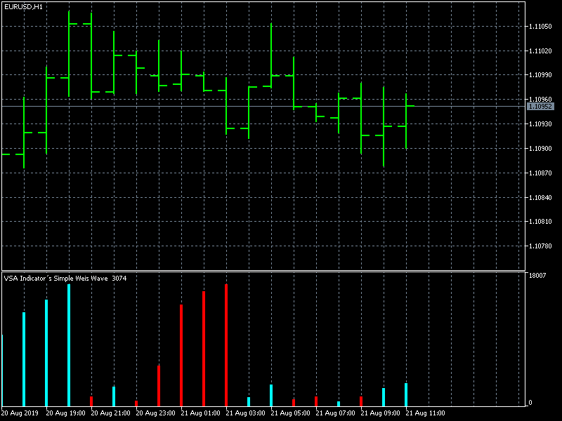

# VSA Indicator´s Simple Weis Wave (MT5)

> Source: https://fxcodebase.com/code/viewtopic.php?f=38&t=68822  
> Forum: 38 · Topic 68822 · 4 post(s)

---

## VSA Indicator´s Simple Weis Wave (MT5)

**Apprentice** · Wed Aug 21, 2019 5:12 am

Based on request.
[viewtopic.php?f=27&t=68814](https://fxcodebase.com/code/viewtopic.php?f=27&t=68814)

 [VSA Indicator´s Simple Weis Wave .mq5](files/128082/VSA%20Indicators%20Simple%20Weis%20Wave%20.mq5)

---

## Re: VSA Indicator´s Simple Weis Wave (MT5)

**julietwisk** · Tue Mar 10, 2020 1:23 pm

Hello! I am using the VSA Indicator´s Simple Weis Wave (MT5). I would like to know how the indicator calibration works using the option "wave ticks", whose default value is 15. What is the value of this setting based on? Thanks!

---

## Re: VSA Indicator´s Simple Weis Wave (MT5)

**Apprentice** · Wed Mar 11, 2020 3:28 am

Your request is added to the development list.
Development reference 853.

---

## Re: VSA Indicator´s Simple Weis Wave (MT5)

**Apprentice** · Wed Mar 11, 2020 4:06 am

I think it'll be impossible to tell by looking at the code.
