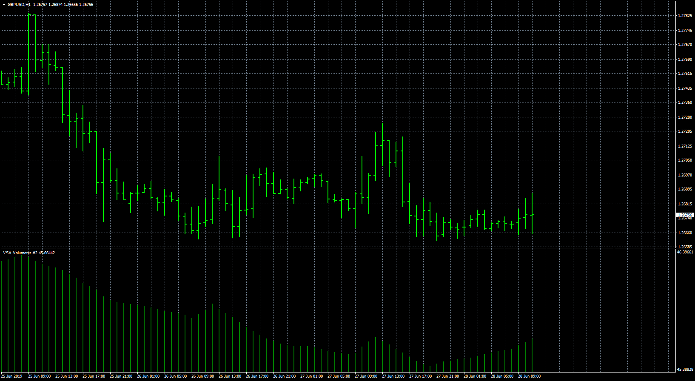
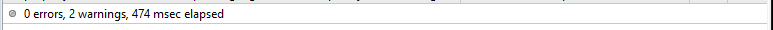

# VSA Volumeter

> Source: https://fxcodebase.com/code/viewtopic.php?f=38&t=68610  
> Forum: 38 · Topic 68610 · 13 post(s)

---

## VSA Volumeter

**Apprentice** · Fri Jun 28, 2019 4:00 am

Based on TS2/Lua original
[viewtopic.php?f=17&t=68395](https://fxcodebase.com/code/viewtopic.php?f=17&t=68395)

 [VSA Volumeter.mq4](files/127135/VSA%20Volumeter.mq4)

Please install ZigZag.mq4

 [ZigZag.mq4](files/127135/ZigZag.mq4)

 [VSA_Volumeter.mq5](files/127135/VSA_Volumeter.mq5)

---

## Re: VSA Volumeter

**aladdin007** · Sun Sep 22, 2019 2:16 pm

Hi MR apprentice
Why this volumeter is late by 8 bar ? See the picture please

---

## Re: VSA Volumeter

**Apprentice** · Mon Sep 23, 2019 5:50 am

ZigZag inherited delay, can not be fixed.

---

## Re: VSA Volumeter

**logicgate** · Sun Feb 07, 2021 3:20 pm

Can we get a version for MT5?

---

## Re: VSA Volumeter

**Apprentice** · Sun Feb 07, 2021 6:27 pm

Your request is added to the development list.
Development reference 163.

---

## Re: VSA Volumeter

**logicgate** · Sun Feb 14, 2021 3:02 pm

Regarding development reference 163:

I noticed that the volumeter formula Is calculated as upVolume / (upVolume + downVolume) * 100

Can you use in the volumeter formula the definition of upVolume and downVolume as determined by the formula of the TicksSeparateVolumeDif indicator (attached to this post)?

Best regards

---

## Re: VSA Volumeter

**Apprentice** · Tue Apr 20, 2021 4:07 pm

Task 163
VSA_Volumeter.mq5 added.

---

## Re: VSA Volumeter

**logicgate** · Wed Apr 21, 2021 7:55 am

Thanks buddy, gonna test it now.

---

## Re: VSA Volumeter

**robertomargot** · Fri Apr 30, 2021 2:24 pm

Hi guys

I tried to compile the indicator presented the errors below:

> 'Z' - unrecognized character escape sequence	VSA_Volumeter.mq5	85	45
> declaration of 'first' hides local variable	VSA_Volumeter.mq5	117	11

could someone help me fix them?

Thank you very much

---

## Re: VSA Volumeter

**Apprentice** · Sat May 01, 2021 4:19 am

Try are only warnings.

---

## Re: VSA Volumeter

**robertomargot** · Mon May 03, 2021 10:32 pm

**Hi Mr apprentice**
The indicator worked but with a lot of delay. Is there a way to remove the zig zag and leave it as the mt4 version?

Thank you very much

> **Apprentice wrote:**
>
>
> Capture.PNG
>
>
> Try are only warnings.

---

## Re: VSA Volumeter

**Apprentice** · Tue May 04, 2021 3:54 pm

Zig zag is an integral part of indicator logic.
Can you suggest an alternative?
Maybe two ma cross?

---

## Re: VSA Volumeter

**robertomargot** · Sat May 22, 2021 11:18 pm

I consulted some developer friends and they didn't find a solution either!

> **Apprentice wrote:**
> Zig zag is an integral part of indicator logic.
> Can you suggest an alternative?
> Maybe two ma cross?
