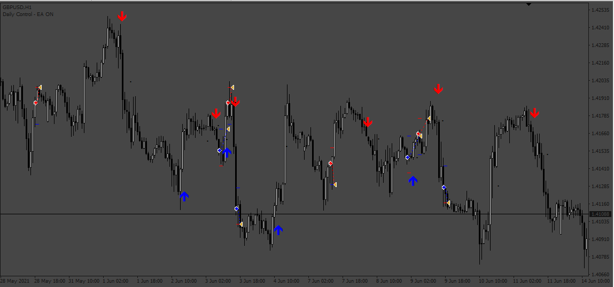
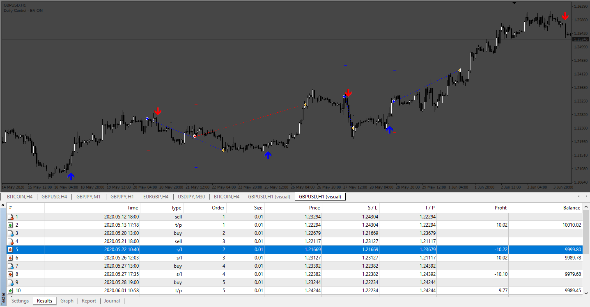

# Vulkan_Profit_EA

> Source: https://fxcodebase.com/code/viewtopic.php?f=38&t=72542  
> Forum: 38 · Topic 72542 · 4 post(s)

---

## Vulkan_Profit_EA

**Apprentice** · Thu Jul 21, 2022 2:11 am

Based on the request.
[https://fxcodebase.com/code/viewtopic.php?f=38&p=146655](https://fxcodebase.com/code/viewtopic.php?f=38&p=146655)

 [Vulkan Profit.ex4](files/146841/Vulkan%20Profit.ex4)

 [Vulkan_Profit_EA.mq4](files/146841/Vulkan_Profit_EA.mq4)

---

## Re: Vulkan_Profit_EA

**Snowfox1991** · Fri Jul 29, 2022 4:12 am

Can you please help check this Vulkan EA, I am running demo but the useSLMoney set to 100 and it is not working well with that. It only close the profit one, the loss one is not closed. Many thanks

---

## Re: Vulkan_Profit_EA

**Apprentice** · Tue Aug 02, 2022 5:18 am

We have added your request to the development list.
Development reference 462.

---

## Re: Vulkan_Profit_EA

**Apprentice** · Thu Aug 04, 2022 4:21 am

I take a look to the SL and TP, and working well... I can't find an issue
