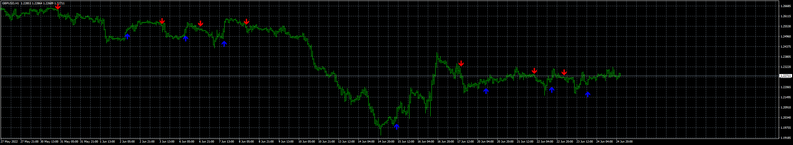
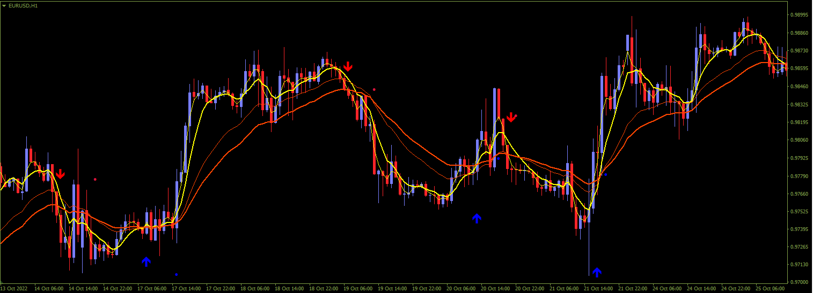

# Vulkan Profit EA

> Source: https://fxcodebase.com/code/viewtopic.php?f=38&t=72681  
> Forum: 38 · Topic 72681 · 16 post(s)

---

## Vulkan Profit EA

**Apprentice** · Wed Aug 31, 2022 1:32 pm

Based on the request.
[https://fxcodebase.com/code/viewtopic.php?f=38&t=71957](https://fxcodebase.com/code/viewtopic.php?f=38&t=71957)

 [Vulkan Profit EA.mq4](files/147308/Vulkan%20Profit%20EA.mq4)

 [Vulkan Profit.ex4](files/147308/Vulkan%20Profit.ex4)

TS2 version.
[https://fxcodebase.com/code/viewtopic.php?f=31&t=73322](https://fxcodebase.com/code/viewtopic.php?f=31&t=73322)

---

## Re: Vulkan Profit EA

**kromdhane** · Sun Nov 13, 2022 6:40 am

Hi Apprentice,

Is it possible to have the MQ5 version of the attached EA.

Also, would it be possible to add a parameter to specify the maximum number of orders for each trade (same parameter for buy and sell).

Thank you so much in advance.

---

## Re: Vulkan Profit EA

**Apprentice** · Tue Nov 15, 2022 4:09 am

We are working on it.
Problem, Vulkan Profit.ex4 is coded.
We will try to reverse-engineer it,
but we can't guarantee that our logic will be the same.

---

## Vulkan_Profit_EA

**Apprentice** · Thu Nov 17, 2022 3:57 am

 [Vulkan_Profit_EA.mq5](files/148380/Vulkan_Profit_EA.mq5)

 [The Sidus Method.pdf](files/148380/The%20Sidus%20Method.pdf)

---

## Re: Vulkan Profit EA

**xristos1982** · Wed Feb 01, 2023 4:47 pm

Can i have this in lua please?Also,i would like this indicator only with arrows,up and down.

---

## Re: Vulkan Profit EA

**Apprentice** · Thu Feb 02, 2023 4:39 am

We have added your request to the development list.
Development reference 112.

---

## Re: Vulkan Profit EA

**Apprentice** · Thu Feb 02, 2023 9:35 am

TS2 version.
[https://fxcodebase.com/code/viewtopic.php?f=31&t=73322](https://fxcodebase.com/code/viewtopic.php?f=31&t=73322)

---

## Re: Vulkan Profit EA

**xristos1982** · Thu Feb 02, 2023 12:50 pm

My mistake,i want the indicator not the strategy.Something like that:
[https://stonehillforex.com/2023/01/vulk ... indicator/](https://stonehillforex.com/2023/01/vulkan-profit-as-a-confirmation-indicator/)

---

## Re: Vulkan Profit EA

**Apprentice** · Sun Feb 05, 2023 4:29 am

We have added your request to the development list.
Development reference 125.

---

## Re: Vulkan Profit EA

**Apprentice** · Sun Feb 05, 2023 11:38 am

Try this version.
[https://fxcodebase.com/code/viewtopic.php?f=17&t=73343](https://fxcodebase.com/code/viewtopic.php?f=17&t=73343)

---

## Re: Vulkan Profit EA

**Pantera** · Sun Feb 05, 2023 2:55 pm

Apprentice,

I've been testing this EA on mean Renko charts and it works very well. What would make it much better would be the addition of a trailing stop, with trailing stop start.

Also, when I try to use partial lot sizes with the EA, I get MT4 Error 131, so I'm forced to use 1.0, 2.0, etc. for lot sizes.

Thank you.

---

## Re: Vulkan Profit EA

**Pantera** · Sun Feb 05, 2023 3:07 pm

> **xristos1982 wrote:**
> My mistake,i want the indicator not the strategy.Something like that:
> [https://stonehillforex.com/2023/01/vulk ... indicator/](https://stonehillforex.com/2023/01/vulkan-profit-as-a-confirmation-indicator/)

The original Vulkan Profit.ex4 indicator is brilliant as an indicator for manual trading, particularly on Mean Renko charts. Just follow the arrows. BTW, the arrows are non-repainting. Unfortunately, it's not so great in an EA environment because the signals don't correspond with the arrows and they aren't always very good. If only we had the .mq4 file, then it could be modified.

---

## Re: Vulkan Profit EA

**Apprentice** · Wed Feb 08, 2023 8:40 am

We have added your request to the development list.
Development reference 140.

---

## Re: Vulkan Profit EA

**xristos1982** · Wed Feb 08, 2023 2:23 pm

> **Apprentice wrote:**
> Try this version.
> [https://fxcodebase.com/code/viewtopic.php?f=17&t=73343](https://fxcodebase.com/code/viewtopic.php?f=17&t=73343)

Τhank you

---

## Re: Vulkan Profit EA

**Karimrjh** · Thu Jan 11, 2024 7:52 am

Is it possible to make a Pinescript Indicator from Vulkan Profit Indicator?

---

## Re: Vulkan Profit EA

**Apprentice** · Sat Jan 13, 2024 3:33 pm

We have added your request to the development list.
Development reference 69
