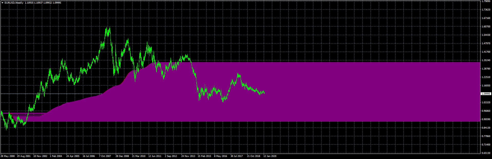

# VWAP Gap Level

> Source: https://fxcodebase.com/code/viewtopic.php?f=38&t=69391  
> Forum: 38 · Topic 69391 · 6 post(s)

---

## VWAP Gap Level

**Apprentice** · Thu Feb 06, 2020 9:08 am

Based on request.
[viewtopic.php?f=27&t=69378](https://fxcodebase.com/code/viewtopic.php?f=27&t=69378)

 [VWAP Gap Level.mq4](files/131136/VWAP%20Gap%20Level.mq4)

---

## Re: VWAP Gap Level

**aladdin007** · Thu Feb 06, 2020 9:33 pm

Thank you so much for the work Mr Mario apprentice
God bless you

---

## Re: VWAP Gap Level

**aladdin007** · Sat Feb 08, 2020 6:11 am

Hi Mr Mario apprentice

Can you make it’s work in 5 and 15 min to time frame

Thank you so much for the great work

---

## Re: VWAP Gap Level

**Apprentice** · Mon Feb 10, 2020 6:17 am

Your request is added to the development list.
Development reference 701.

---

## Re: VWAP Gap Level

**Apprentice** · Tue Feb 11, 2020 6:41 am

Should works on any timeframe

---

## Re: VWAP Gap Level

**aladdin007** · Wed Feb 12, 2020 7:10 am

Thank you for the answer Mr Mario apprentice
