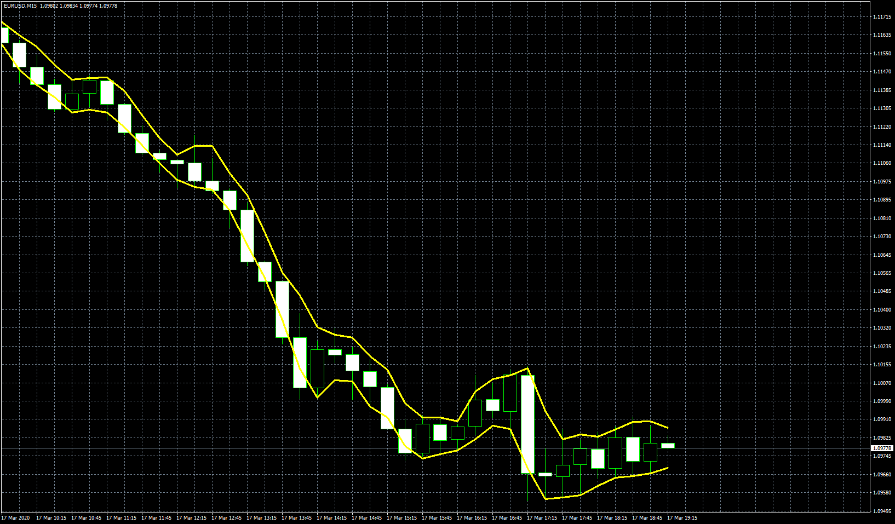

# vwap high low

> Source: https://fxcodebase.com/code/viewtopic.php?f=38&t=69940  
> Forum: 38 · Topic 69940 · 2 post(s)

---

## vwap high low

**Apprentice** · Fri May 29, 2020 5:13 am

Based on request.
[viewtopic.php?f=27&t=69915](https://fxcodebase.com/code/viewtopic.php?f=27&t=69915)

 [VWAP_Indicator.mq4](files/134446/VWAP_Indicator.mq4)

---

## Re: vwap high low

**aladdin007** · Fri May 29, 2020 11:09 pm

Thank you so much Mr Mario apprentice
Great work god bless you bro
