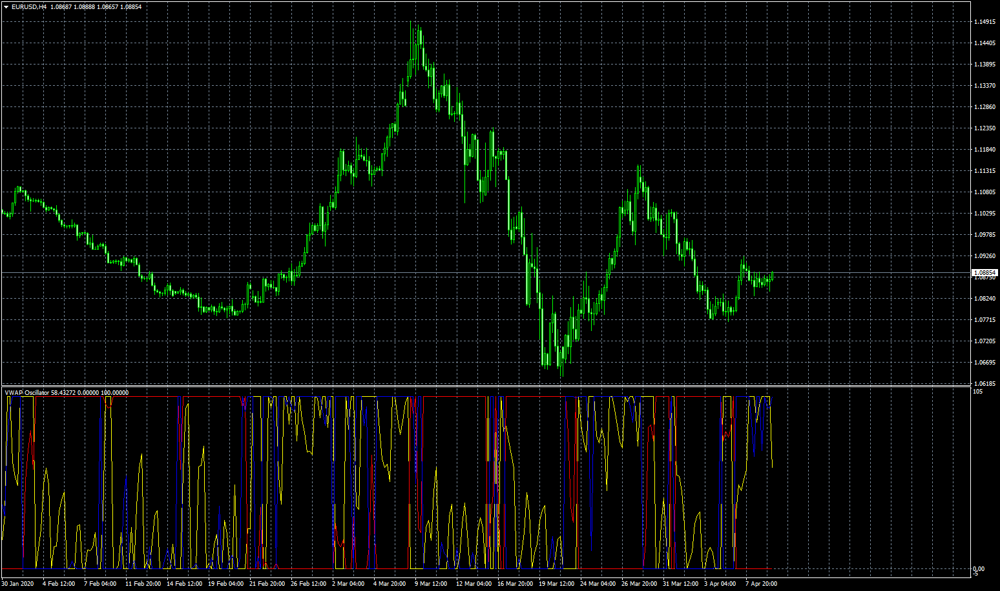

# VWAP_Oscillator_normilized

> Source: https://fxcodebase.com/code/viewtopic.php?f=38&t=69640  
> Forum: 38 · Topic 69640 · 22 post(s)

---

## VWAP_Oscillator_normilized

**Apprentice** · Thu Apr 09, 2020 7:09 am

 [VWAP_Oscillator_normilized.mq4](files/132705/VWAP_Oscillator_normilized.mq4)

---

## Re: VWAP_Oscillator_normilized

**aladdin007** · Mon May 25, 2020 6:15 pm

hi Mr Mario apprentice

why every monday the vwap 2 lines look like that ?

---

## Re: VWAP_Oscillator_normilized

**Apprentice** · Tue May 26, 2020 8:20 am

VWAP is calculated like this.

---

## Re: VWAP_Oscillator_normilized

**aladdin007** · Tue May 26, 2020 2:12 pm

Can you make Vwap oscillator normalized show and being like that every day not just on Monday ?

---

## Re: VWAP_Oscillator_normilized

**Apprentice** · Wed May 27, 2020 5:06 am

Your request is added to the development list.
Development reference 1370.

---

## Re: VWAP_Oscillator_normilized

**aladdin007** · Mon Jun 08, 2020 12:24 pm

Hi Mr Mario apprentice
Any news about the indicator ?

Thank you

---

## Re: VWAP_Oscillator_normilized

**Apprentice** · Tue Jun 09, 2020 6:15 am

Unfortunately no,
we are overwhelmed by task inflow.
I will post any updates here.

---

## Re: VWAP_Oscillator_normilized

**Apprentice** · Thu Jun 11, 2020 6:08 am

How Normalization will be calculated?

---

## Re: VWAP_Oscillator_normilized

**aladdin007** · Thu Jun 11, 2020 6:20 am

I want him in each new day return to zero and star new calculations so I can have this kind of signals he give every Monday

---

## Re: VWAP_Oscillator_normilized

**aladdin007** · Fri Jun 12, 2020 11:20 pm

Hi Mr Mario apprentice

Please add time frame 5,15,30,h1..
Please add the option add symbols,so I can add different symbols at the same chart
Thank you so much

This is the script
[https://ctrader.com/algos/indicators/show/2142](https://ctrader.com/algos/indicators/show/2142)

Code: [Select all](https://fxcodebase.com/code/)
`using System;
using cAlgo.API;
using cAlgo.API.Internals;
using cAlgo.API.Indicators;
using cAlgo.Indicators;
 
namespace cAlgo
{
    [Levels(0, 1, 2, 3, -1, -2, -3)]
    [Indicator(IsOverlay = false, ScalePrecision = 1, TimeZone = TimeZones.UTC, AccessRights = AccessRights.None)]
    public class VWAPOscilattor : Indicator
    {
        [Parameter(DefaultValue = 5)]
        public int Thickness { get; set; }
        [Parameter(DefaultValue = 11)]
        public TimeFrame TF { get; set; }
 
        [Output("Open", PlotType = PlotType.Points, LineColor = "Black")]
        public IndicatorDataSeries Open { get; set; }
        [Output("High", PlotType = PlotType.Points, LineColor = "Black")]
        public IndicatorDataSeries High { get; set; }
        [Output("Loe", PlotType = PlotType.Points, LineColor = "Black")]
        public IndicatorDataSeries Low { get; set; }
        [Output("Close", PlotType = PlotType.Points, LineColor = "Black")]
        public IndicatorDataSeries Close { get; set; }
 
        [Output("0", LineColor = "Gray")]
        public IndicatorDataSeries ZeroLine { get; set; }
        [Output("1", LineColor = "FFFF999A")]
        public IndicatorDataSeries FirstUpperBand { get; set; }
        [Output("2", LineColor = "FFFF5B62")]
        public IndicatorDataSeries SecondUpperBand { get; set; }
        [Output("3", LineColor = "FFFF0000")]
        public IndicatorDataSeries ThirdUpperBand { get; set; }
        [Output("-1", LineColor = "FF9CFF9C")]
        public IndicatorDataSeries FirstLowerBand { get; set; }
        [Output("-2", LineColor = "FF4EFF4E")]
        public IndicatorDataSeries SecondLowerBand { get; set; }
        [Output("-3", LineColor = "FF00FF00")]
        public IndicatorDataSeries ThirdLowerBand { get; set; }
 
        Bars Series;
 
        protected override void Initialize()
        {
            Series = MarketData.GetBars(TF);
        }
 
        public override void Calculate(int index)
        {
            double vwapValue = 0, volumesSum = 0;
            int startIndex = Bars.OpenTimes.GetIndexByTime(Series.OpenTimes[Series.OpenTimes.GetIndexByTime(Bars.OpenTimes[index])]);
 
            for (int i = index; i >= startIndex; i--)
            {
                vwapValue += Bars[i].Close * Bars[i].TickVolume;
                volumesSum += Bars[i].TickVolume;
            }
 
            vwapValue /= volumesSum;
 
            double vwapSTD = 0;
 
            for (int i = index; i >= startIndex; i--)
            {
                vwapSTD += Math.Pow(Bars[i].Close - vwapValue, 2);
            }
            vwapSTD = Math.Sqrt(vwapSTD / (index - startIndex + 1));
 
            Close[index] = (Bars[index].Close - vwapValue) / vwapSTD;
            Open[index] = (Bars[index].Open - vwapValue) / vwapSTD;
            High[index] = (Bars[index].High - vwapValue) / vwapSTD;
            Low[index] = (Bars[index].Low - vwapValue) / vwapSTD;
 
            Close[index] = double.IsInfinity(Close[index]) ? 0 : Close[index];
            Open[index] = double.IsInfinity(Open[index]) ? 0 : Open[index];
            High[index] = double.IsInfinity(High[index]) ? 0 : High[index];
            Low[index] = double.IsInfinity(Low[index]) ? 0 : Low[index];
 
            Close[index] = Close[index] > 5 ? 5 : Close[index] < -5 ? -5 : Close[index];
            Open[index] = Open[index] > 5 ? 5 : Open[index] < -5 ? -5 : Open[index];
            High[index] = High[index] > 5 ? 5 : High[index] < -5 ? -5 : High[index];
            Low[index] = Low[index] > 5 ? 5 : Low[index] < -5 ? -5 : Low[index];
 
            IndicatorArea.DrawTrendLine("HL " + index, index, High[index], index, Low[index], Close[index] > Open[index] ? Color.Green : Color.Red);
            IndicatorArea.DrawTrendLine("Body " + index, index, Close[index], index, Open[index], Close[index] > Open[index] ? Color.Green : Color.Red, Thickness);
 
            ZeroLine[index] = 0;
            FirstLowerBand[index] = -1;
            FirstUpperBand[index] = 1;
            SecondLowerBand[index] = -2;
            SecondUpperBand[index] = 2;
            ThirdLowerBand[index] = -3;
            ThirdUpperBand[index] = 3`

---

## Re: VWAP_Oscillator_normilized

**Apprentice** · Sun Jun 14, 2020 7:24 pm

Your request is added to the development list.
Development reference 1479.

---

## Re: VWAP_Oscillator_normilized

**Apprentice** · Tue Jun 16, 2020 7:19 am

I still don't understand.
That explanation doesn't fit into the current formula

Is it a new unrelated request?

---

## Re: VWAP_Oscillator_normilized

**aladdin007** · Tue Jun 16, 2020 7:50 am

Hir Mr Mario Apprentice

I find this formula script better,just add in this indicator the options add other symbols with times frame
Thank you so much sorry about my English
God bless you bro

---

## Re: VWAP_Oscillator_normilized

**aladdin007** · Wed Jun 17, 2020 7:00 am

GOOd morning Mr Mario apprentice
 Can you check please the indicator it’s freez my platform
Thank you so much

---

## Re: VWAP_Oscillator_normilized

**aladdin007** · Wed Jun 17, 2020 10:15 am

I did try the indicator in other platform it’s freez when I put XAUAUD its freez the platform

---

## Re: VWAP_Oscillator_normilized

**Apprentice** · Wed Jun 17, 2020 3:30 pm

Try to use lower bars_limit.

---

## Re: VWAP_Oscillator_normilized

**aladdin007** · Wed Jun 17, 2020 4:50 pm

I did use lower bar limit still freez when I put other symbols
Can you please don’t change nothing from the original vwap oscillator normalized and add just option other symbols and time frame please
Thank you so much

---

## Re: VWAP_Oscillator_normilized

**Apprentice** · Thu Jun 18, 2020 5:17 am

Your request is added to the development list.
Development reference 1512.

---

## Re: VWAP_Oscillator_normilized

**Apprentice** · Fri Jun 19, 2020 5:03 am

[VWAP_Oscillator_normilized v1.7.mq4](files/135105/VWAP_Oscillator_normilized%20v1.7.mq4)

Try this version.

---

## Re: VWAP_Oscillator_normilized

**aladdin007** · Fri Jun 19, 2020 10:18 pm

Thank you so much Mr Mario apprentice
Thank you for the great work
God bless you

---

## Re: VWAP_Oscillator_normilized

**mouakkit.latifa** · Sun Jul 25, 2021 5:45 pm

> **Apprentice wrote:**
>
>
> eurusd-h4-fxcm-australia-pty.png
>
>
>
>
> VWAP_Oscillator_normilized.mq4

hi can you make this indicator vwap normalized base Time Segmented Volume

thank you

---

## Re: VWAP_Oscillator_normilized

**Apprentice** · Tue Jul 27, 2021 2:56 am

I'm not sure I understand your request.
Can you clarify?
Normalize Time Segmented Volume.MQ4?
[https://fxcodebase.com/code/viewtopic.php?f=38&t=65882](https://fxcodebase.com/code/viewtopic.php?f=38&t=65882)
