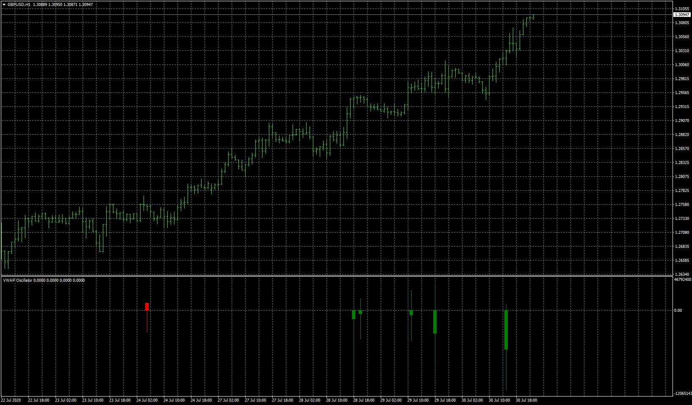

# Vwap oscillator

> Source: https://fxcodebase.com/code/viewtopic.php?f=38&t=70243  
> Forum: 38 · Topic 70243 · 10 post(s)

---

## Vwap oscillator

**Apprentice** · Thu Jul 30, 2020 5:23 pm

Based on request.
[viewtopic.php?f=38&p=135234](https://fxcodebase.com/code/viewtopic.php?f=38&p=135234)

 [Vwap oscillator.mq4](files/136446/Vwap%20oscillator.mq4)

---

## Re: Vwap oscillator

**aladdin007** · Sun Aug 02, 2020 7:25 am

Thank you so much Mr Mario Apprentice for the great work

I try to use others time frame but it’s not working can you fix that please

Thank you so much again bro

---

## Re: Vwap oscillator

**aladdin007** · Sun Aug 02, 2020 7:27 am

Sorry I mean when I change the time frame on the indicator nothing change
It’s work just on the time frame chart

---

## Re: Vwap oscillator

**Apprentice** · Sun Aug 02, 2020 8:31 am

Your request is added to the development list.
Development reference 1812.

---

## Re: Vwap oscillator

**Apprentice** · Tue Aug 04, 2020 4:56 am

[Vwap oscillator.mq4](files/136571/Vwap%20oscillator.mq4)

Try this version.

---

## Re: Vwap oscillator

**aladdin007** · Tue Aug 04, 2020 2:49 pm

Dear Mario apprentice thank you loot about this great work it’s amazing
Is it possible to add other symbols please to this indicator
Thank you looooot

---

## Re: Vwap oscillator

**Apprentice** · Wed Aug 05, 2020 4:16 am

Your request is added to the development list.
Development reference 1830.

---

## Re: Vwap oscillator

**aladdin007** · Thu Aug 06, 2020 8:53 am

Thank you so much Dear Mario Apprentice
I have question there is any solution he make the CPU of my computer sooooo slow
If you ad bars limit is that can help .?
Thank you so so much

---

## Re: Vwap oscillator

**Apprentice** · Tue Aug 11, 2020 5:26 am

[Vwap oscillator OS BTF.mq4](files/136779/Vwap%20oscillator%20OS%20BTF.mq4)

Try this version.

---

## Re: Vwap oscillator

**aladdin007** · Tue Aug 11, 2020 5:46 pm

Thank you so much Mr Mario apprentice
Thank you looot
God bless you
