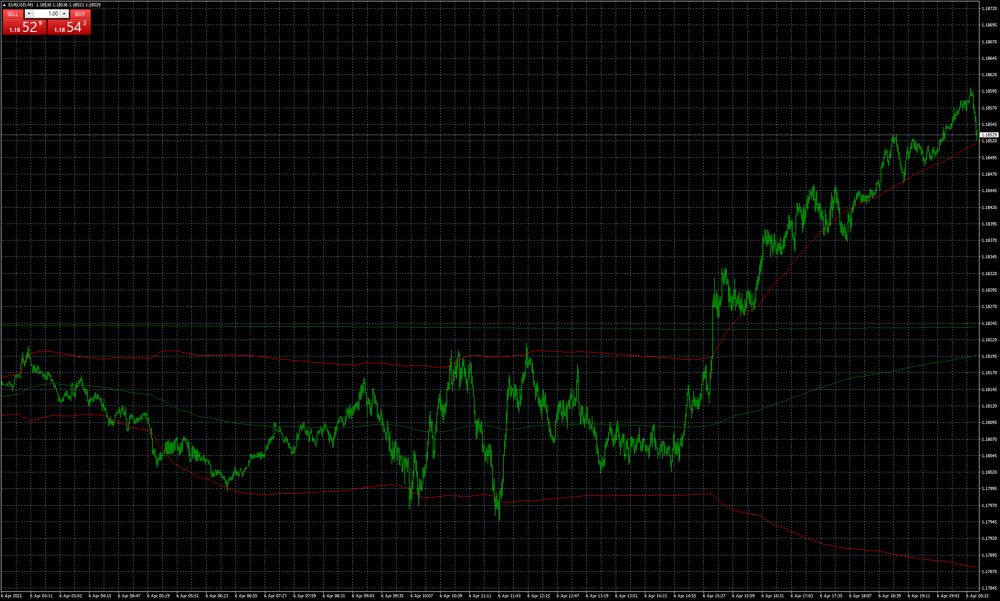

# VWAP Stdev Bands v2

> Source: https://fxcodebase.com/code/viewtopic.php?f=38&t=71062  
> Forum: 38 · Topic 71062 · 5 post(s)

---

## VWAP Stdev Bands v2

**Apprentice** · Tue Apr 06, 2021 12:28 pm

Based on the request.
[https://fxcodebase.com/code/viewtopic.p ... 60#p141360](https://fxcodebase.com/code/viewtopic.php?f=27&p=141360#p141360)

 [VWAP Stdev Bands v2.mq4](files/141409/VWAP%20Stdev%20Bands%20v2.mq4)

---

## Re: VWAP Stdev Bands v2

**fXbeee** · Tue Nov 22, 2022 4:08 am

thank you for developing the vwap stdev band v2. i've tried it and set
the bars_limit to 65 for the M5 tf however it didn't start resetting
the vwap calculation on the opening of the next day. is there any way
that u can guide me how to add this functionality into this great
indicator?

thank you with kind regards

suthipoj

---

## Re: VWAP Stdev Bands v2

**Apprentice** · Tue Nov 22, 2022 4:26 am

We have added your request to the development list.
Development reference 770.

---

## Re: VWAP Stdev Bands v2

**Teruyoshi** · Thu Oct 09, 2025 9:04 am

Would you turn this band into a volatility ranking indicator, which allows me to know which pair or which currency (main 8) to tade on band width basis between＋2σ and －2σ.
At the same time, if possible , it would be nice to see 8 currency's transition.
What I want is a indi which lets me trace the changes of volatility and show latest ranking.
 I once asked AI to make the indi avobe but it doesn't make the very one.
 So many thanks in advance.

---

## Re: VWAP Stdev Bands v2

**Apprentice** · Sun Oct 12, 2025 2:24 am

We have added your request to the development list.
Development reference 654
