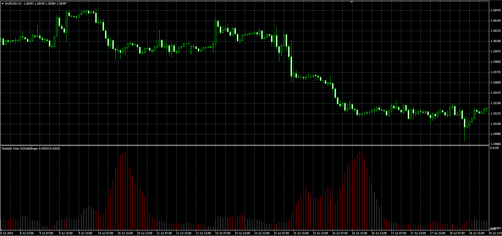

# Waddah Attar ADXxBollinger

> Source: https://fxcodebase.com/code/viewtopic.php?f=38&t=61256  
> Forum: 38 · Topic 61256 · 1 post(s)

---

## Waddah Attar ADXxBollinger

**Alexander.Gettinger** · Thu Sep 25, 2014 9:48 am

Original LUA oscillator: [viewtopic.php?f=17&t=27291](https://fxcodebase.com/code/viewtopic.php?f=17&t=27291).

Formula:
WAAB = (TL-BL)*ADX,
Color = Green, if DIP>DIM, else Color = Red, where
TL, BL - top and bottom lines of Bolinger bands,
DIP, DIM - +DI and -DI of ADX.

 

Download:

 [WAAB.mq4](files/96201/WAAB.mq4)
