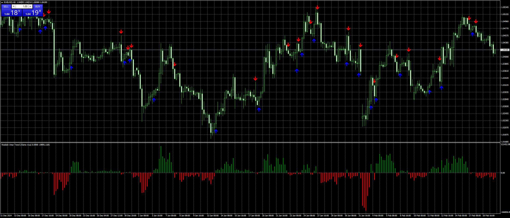

# Waddah_Attar_Trend_v2

> Source: https://fxcodebase.com/code/viewtopic.php?f=38&t=75634  
> Forum: 38 · Topic 75634 · 5 post(s)

---

## Waddah_Attar_Trend_v2

**Apprentice** · Wed Feb 19, 2025 2:01 pm

Based on the request.
[https://fxcodebase.com/code/viewtopic.php?f=38&t=75604](https://fxcodebase.com/code/viewtopic.php?f=38&t=75604)

 [Waddah_Attar_Trend_v2.mq4](files/158333/Waddah_Attar_Trend_v2.mq4)

---

## Re: Waddah_Attar_Trend_v2

**Frans88** · Thu Feb 20, 2025 11:20 pm

can you fix the indicator?
arrow not appear when alert triggered

---

## Re: Waddah_Attar_Trend_v2

**Apprentice** · Sat Feb 22, 2025 5:33 am

We have added your request to the development list.
Development reference 134

---

## Re: Waddah_Attar_Trend_v2

**Apprentice** · Mon Feb 24, 2025 11:16 am

[Waddah_Attar_Trend_v3.mq4](files/158393/Waddah_Attar_Trend_v3.mq4)

Try this version.

---

## Re: Waddah_Attar_Trend_v2

**Honest_Trader** · Fri Mar 07, 2025 10:23 am

Thanks my friend for helping us.

I have not been well quite often and hence my frequency to check had been not so good. Please do not feel otherwise, your assistance is always awaited and always appreciated.

God Bless !

Warm Regards
GK
