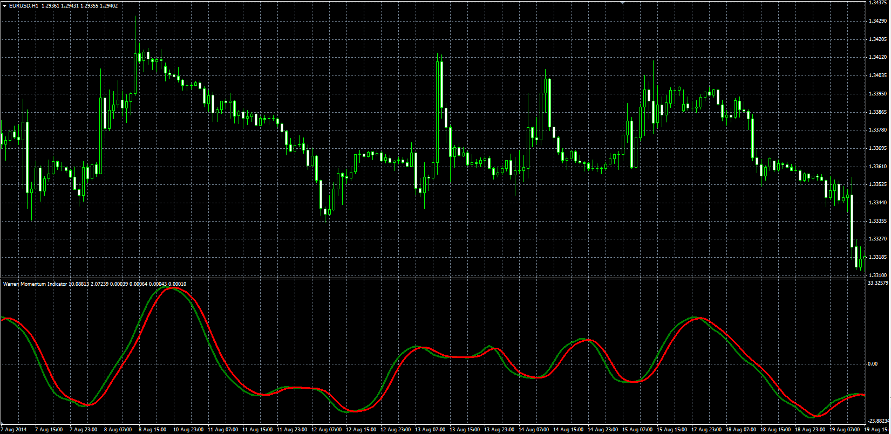

# Warren Momentum Indicator

> Source: https://fxcodebase.com/code/viewtopic.php?f=38&t=61133  
> Forum: 38 · Topic 61133 · 1 post(s)

---

## Warren Momentum Indicator

**Alexander.Gettinger** · Fri Sep 12, 2014 3:46 pm

Original LUA oscillator: [viewtopic.php?f=17&t=59583](https://fxcodebase.com/code/viewtopic.php?f=17&t=59583).

Formulas:
WAMI = MA(MA2) with [MA3_Length] number of periods and [MA3_Method] type,
Signal = MA(WAMI) with [Signal_Length] number of periods and [Signal_Method] type, where
MA2 = MA(MA1) with [MA2_Length] number of periods and [MA2_Method] type,
MA1 = MA(Difference) with [MA1_Length] number of periods and [MA1_Method] type,
Difference[i] = Price[i]-Price[i-1].

 

Download:

 [WAMI.mq4](files/95846/WAMI.mq4)
