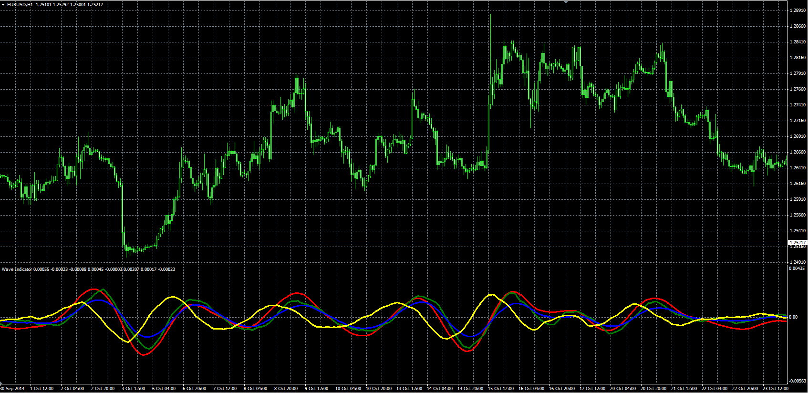

# Wave Indicator

> Source: https://fxcodebase.com/code/viewtopic.php?f=38&t=61468  
> Forum: 38 · Topic 61468 · 2 post(s)

---

## Wave Indicator

**Alexander.Gettinger** · Tue Nov 18, 2014 11:55 am

Original LUA indicator: [viewtopic.php?f=17&t=19657](https://fxcodebase.com/code/viewtopic.php?f=17&t=19657).

 

Download:

 [Wave_Indicator.mq4](files/97162/Wave_Indicator.mq4)

---

## Re: Wave Indicator

**diegolopezdiego** · Tue Mar 12, 2019 9:09 am

Hello, thank you very much for sharing this and many indicators.

Could you explain how this indicator works exactly? The first impression is that the yellow and red lines are the trigger of the trades. But I'm not sure.

Sorry for my English, I'm from Argentina and I'm using Google translate
