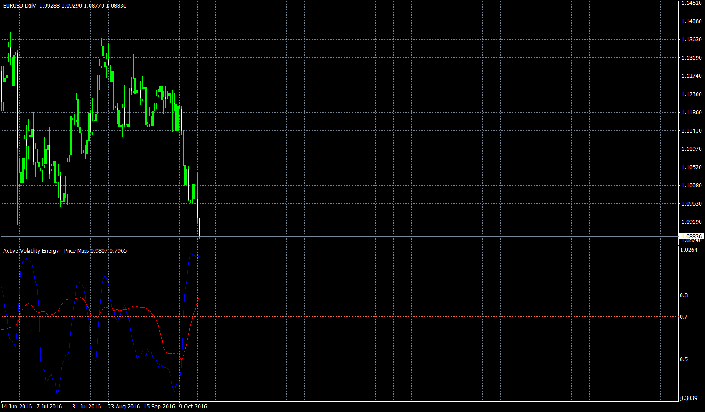

# WAVE-PM (Whistler's Active Volatility Energy - Price Mass)

> Source: https://fxcodebase.com/code/viewtopic.php?f=38&t=64011  
> Forum: 38 · Topic 64011 · 2 post(s)

---

## WAVE-PM (Whistler's Active Volatility Energy - Price Mass)

**Apprentice** · Sat Oct 22, 2016 6:24 am

TS2 / Marketscope original is available here.
[viewtopic.php?f=17&t=1848](https://fxcodebase.com/code/viewtopic.php?f=17&t=1848)

The is a port of one of wonderful indicators described in the Mark Whistler's "Volatility illuminated" book. For details about the indicator please follow [www.fxvolatility.com](http://www.fxvolatility.com/) site to buy an e-book version of the book or buy a [paper version of the book](https://www.amazon.com/Volatility-Illuminated-Empowering-Options-Futures/dp/1441490795/ref=ntt_at_ep_dpt_4) at amazon. The book is really good and worth to buy it.

 [WAVE-PM.mq4](files/108745/WAVE-PM.mq4)

---

## Re: WAVE-PM (Whistler's Active Volatility Energy - Price Mas

**Apprentice** · Mon Jan 23, 2017 2:45 am

Indicator was revised and updated.
