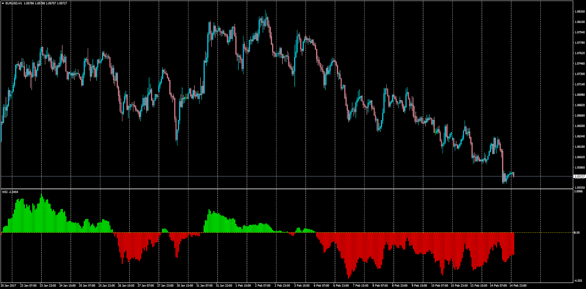

# Wave Segregation Index (WSI)

> Source: https://fxcodebase.com/code/viewtopic.php?f=38&t=64458  
> Forum: 38 · Topic 64458 · 1 post(s)

---

## Wave Segregation Index (WSI)

**Apprentice** · Wed Feb 15, 2017 5:15 am

LUA Original: [viewtopic.php?f=17&t=1060](https://fxcodebase.com/code/viewtopic.php?f=17&t=1060)

Description:

MT4 representation of the LUA original indicator which formula is the following:

WSI = (CCI[100]*TypicalPrice * ADX[100]) / 1000

 [WSI.mq4](files/111068/WSI.mq4)
