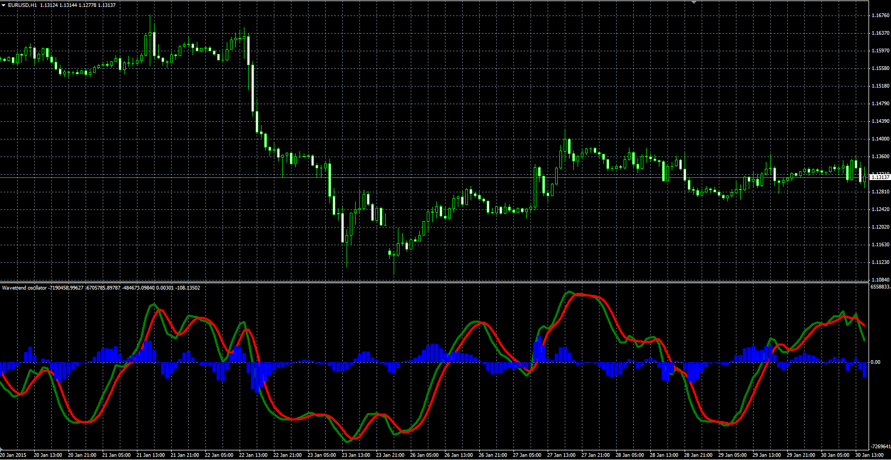

# Wavetrend Oscillator

> Source: https://fxcodebase.com/code/viewtopic.php?f=38&t=61860  
> Forum: 38 · Topic 61860 · 3 post(s)

---

## Wavetrend Oscillator

**Alexander.Gettinger** · Mon Feb 23, 2015 11:23 am

Original LUA oscillator: [viewtopic.php?f=17&t=61668](https://fxcodebase.com/code/viewtopic.php?f=17&t=61668).

Formulas:
wt1 = EMA(Raw2) with [Average_Length] number of periods,
wt2 = MVA(wt1) with [Signal_Length] number of periods,
wt3 = wt1-wt2, where
Raw2 = (TP-EMA1)/(0.015*EMA2),
TP - typical price,
EMA1 = EMA(Typical price) with [Channel_Length] number of periods,
EMA2 = EMA(Raw1) with [Channel_Length] number of periods,
Raw1 = Abs(TP-EMA1),
Abs - absolute value.

 

Download:

 [Wavetrend_Oscillator.mq4](files/98810/Wavetrend_Oscillator.mq4)

---

## Re: Wavetrend Oscillator

**baccicin** · Wed Nov 01, 2017 6:02 am

Hello, i can't see overbought and oversold levels, just 0 line. Is there the possibility to show these levels? Many thanks, have a nice day. Bac

---

## Re: Wavetrend Oscillator

**Apprentice** · Sat Nov 04, 2017 6:01 am

Try it now.
