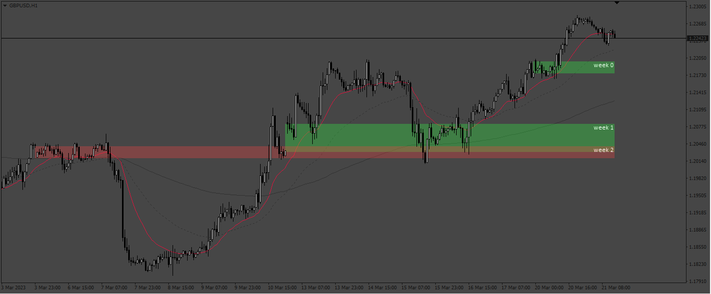

# Weeckly_Gap

> Source: https://fxcodebase.com/code/viewtopic.php?f=38&t=73523  
> Forum: 38 · Topic 73523 · 3 post(s)

---

## Weeckly_Gap

**Apprentice** · Sat Mar 25, 2023 12:32 pm

Based on the request.
[https://fxcodebase.com/code/viewtopic.php?f=17&p=149939](https://fxcodebase.com/code/viewtopic.php?f=17&p=149939)

 [Weeckly_Gap.mq4](files/150120/Weeckly_Gap.mq4)

---

## Re: Weeckly_Gap

**menber100fxcode** · Fri Apr 14, 2023 8:11 pm

Firstly I am very grateful, for coding this great indicator, please add the following:
1. Add the date of each week and daily in the GAP as appropriate.
2. Add the option to select the color and type of line for the weekly or daily GAP.
3. Add a button to show and hide the indicator on the chart.
Thank you in advance for your kind understanding and collaboration.

---

## Re: Weeckly_Gap

**Apprentice** · Wed Apr 19, 2023 5:44 am

We have added your request to the development list.
Development reference 341.
