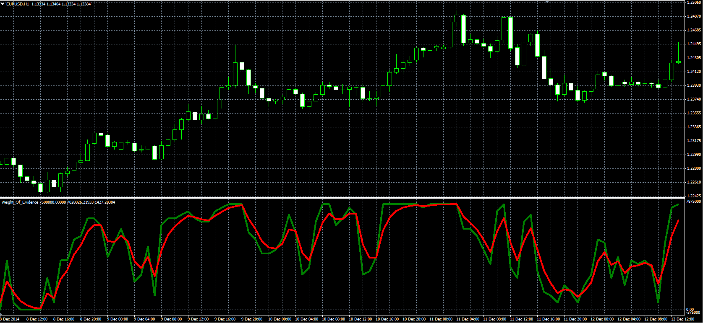

# Weight of Evidence

> Source: https://fxcodebase.com/code/viewtopic.php?f=38&t=62248  
> Forum: 38 · Topic 62248 · 4 post(s)

---

## Weight of Evidence

**Alexander.Gettinger** · Fri May 22, 2015 10:10 am

Original LUA oscillator: [viewtopic.php?f=17&t=62054](https://fxcodebase.com/code/viewtopic.php?f=17&t=62054).

 

Download:

 [Weight_Of_Evidence.mq4](files/100610/Weight_Of_Evidence.mq4)

---

## Re: Weight of Evidence

**Artem.dev** · Sun Sep 09, 2018 2:14 pm

What version of the VAD indicator is used here?
Note: Williams' Accumulation/Distribution, W_A/D does not have adjustable parameters, But in this code there are such lines:

WAD=iCustom(NULL,0,"WAD",2,pos) + iCustom(NULL,0,"WAD",3,pos);

------ The question is inscribed in the function call string:
iCustom(Symbol(),PERIOD_CURRENT,"IndicatorName = WAD",2 - what is it?, index)
iCustom(Symbol(),PERIOD_CURRENT,"IndicatorName = WAD",3 - what is it?, index)
------
Thank you.

---

## Re: Weight of Evidence

**Apprentice** · Mon Sep 10, 2018 9:08 am

Was based on this version of the indicator.
[viewtopic.php?f=27&t=62052](https://fxcodebase.com/code/viewtopic.php?f=27&t=62052)

2 and 3 are line index.

WAD=iCustom(NULL,0,"WAD",2,pos) + iCustom(NULL,0,"WAD",3,pos)
 will give sum of 2 and 3 line of WAD indicator.
Can you provide indicator code for this version?

---

## Re: Weight of Evidence

**Artem.dev** · Mon Sep 10, 2018 12:32 pm

The WAD indicator has only one line. Therefore, there is no way to get the line by index 2 or 3. Only by index 0: iCustom(NULL,0,"WAD",0,pos).
In result: (Data WAD from index 0 - Data WAD from index 0) = 0.
WAD as example: [https://www.mql5.com/en/code/7064](https://www.mql5.com/en/code/7064)
It is for this reason that I asked - what is the version of the WAD indicator used in this indicator?
