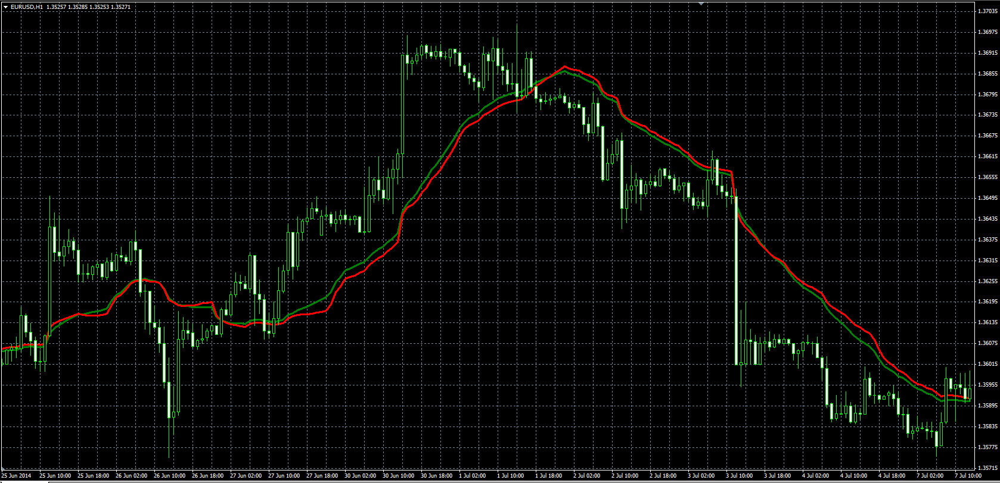

# Weight Volume Move-Adjusted Moving Average

> Source: https://fxcodebase.com/code/viewtopic.php?f=38&t=61047  
> Forum: 38 · Topic 61047 · 1 post(s)

---

## Weight Volume Move-Adjusted Moving Average

**Alexander.Gettinger** · Mon Aug 18, 2014 1:55 pm

Original LUA indicator: [viewtopic.php?f=17&t=60155](https://fxcodebase.com/code/viewtopic.php?f=17&t=60155).

Formulas:
VOMOMA = (MOMA+VOMA)/2,
WEVOMO = (MOMA+VOMA+WMA)/3, where
MOMA[i] = (Close[i-Length+1]*Difference[i-Length+1]+Close[i-Length+2]*Difference[i-Length+2]+...+Close[i]*Difference[i])/Sum(Difference),
VOMA[i] = (Close[i-Length+1]*Volume[i-Length+1]+Close[i-Length+2]*Volume[i-Length+2]+...+Close[i]*Volume[i])/Sum(Volume),
WMA[i] = (Close[i-Length+1]*1+Close[i-Length+2]*2+...+Close[i]*Length)/LSum,
LSum = (Length+1)*Length/2,
Difference[i] = Abs(Close[i]-Close[i-1]),
Abs - absolute value.

 

Download:

 [WEVOMO.mq4](files/95415/WEVOMO.mq4)
