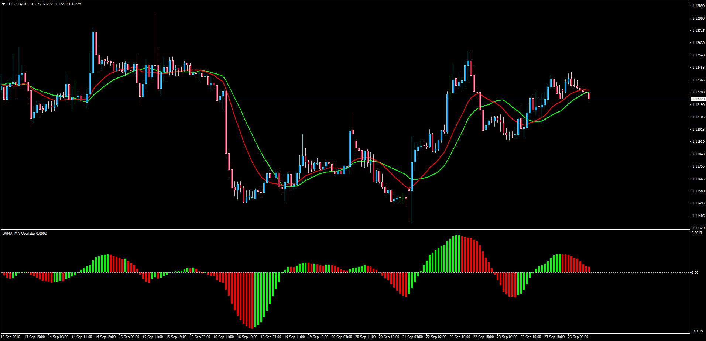

# Weighted Moving Average / Simple Moving Average Oscillator

> Source: https://fxcodebase.com/code/viewtopic.php?f=38&t=63897  
> Forum: 38 · Topic 63897 · 1 post(s)

---

## Weighted Moving Average / Simple Moving Average Oscillator

**Apprentice** · Mon Sep 26, 2016 4:10 am

LUA Original: [viewtopic.php?f=17&t=1866](https://fxcodebase.com/code/viewtopic.php?f=17&t=1866)

Description:

This oscillator is the classic histogram achieved by the difference of two moving averages, although in this case using the following formula:

Current_Histogram_Bar = (LWMA/SMA)-1;

Based on the LUA indicator found here: [viewtopic.php?f=17&t=1866](https://fxcodebase.com/code/viewtopic.php?f=17&t=1866)

For illustration purposes the two main chart moving averages were added to the candles as well.

 [LWMA_MA.mq4](files/108262/LWMA_MA.mq4)
