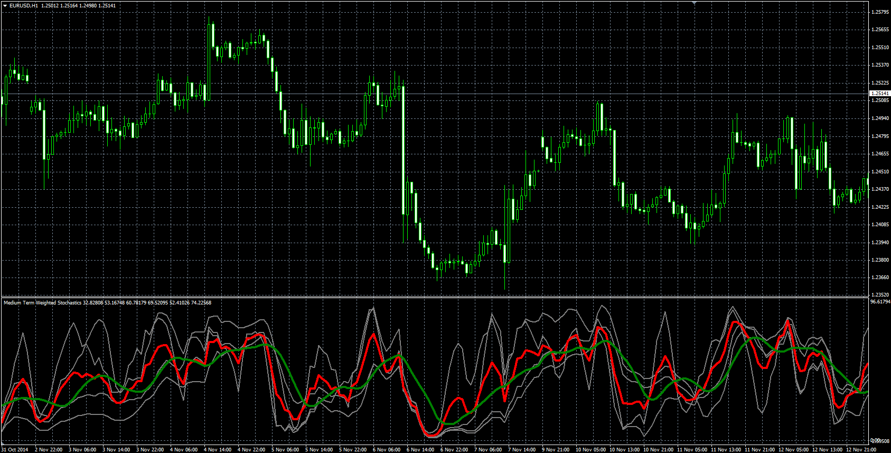

# Weighted Stochastics

> Source: https://fxcodebase.com/code/viewtopic.php?f=38&t=61612  
> Forum: 38 · Topic 61612 · 1 post(s)

---

## Weighted Stochastics

**Alexander.Gettinger** · Fri Dec 19, 2014 3:21 pm

Formula:
STPMT = (Stoch1_Weight*St1+Stoch2_Weight*St2+Stoch3_Weight*St3+Stoch4_Weight*St4)/Sum_Weight, where
Sum_Weight = Stoch1_Weight+Stoch2_Weight+Stoch3_Weight+Stoch4_Weight,
St1 = Stochastic with parameters: Stoch1_Kperiod, Stoch1_Dperiod, Stoch1_Slowing, Stoch1_Method, Stoch1_Price_Field,
St2 = Stochastic with parameters: Stoch2_Kperiod, Stoch2_Dperiod, Stoch2_Slowing, Stoch2_Method, Stoch2_Price_Field,
St3 = Stochastic with parameters: Stoch3_Kperiod, Stoch3_Dperiod, Stoch3_Slowing, Stoch3_Method, Stoch3_Price_Field,
St4 = Stochastic with parameters: Stoch4_Kperiod, Stoch4_Dperiod, Stoch4_Slowing, Stoch4_Method, Stoch4_Price_Field.

 

Download:

 [STPMT.mq4](files/97781/STPMT.mq4)
