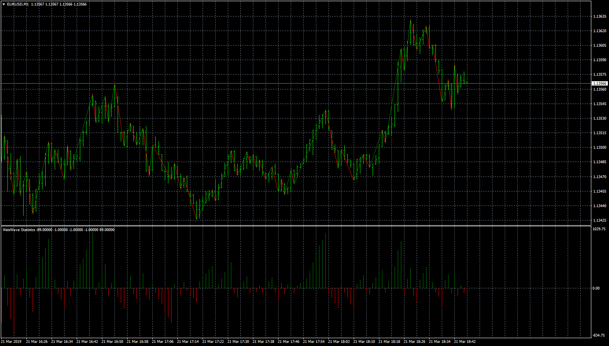
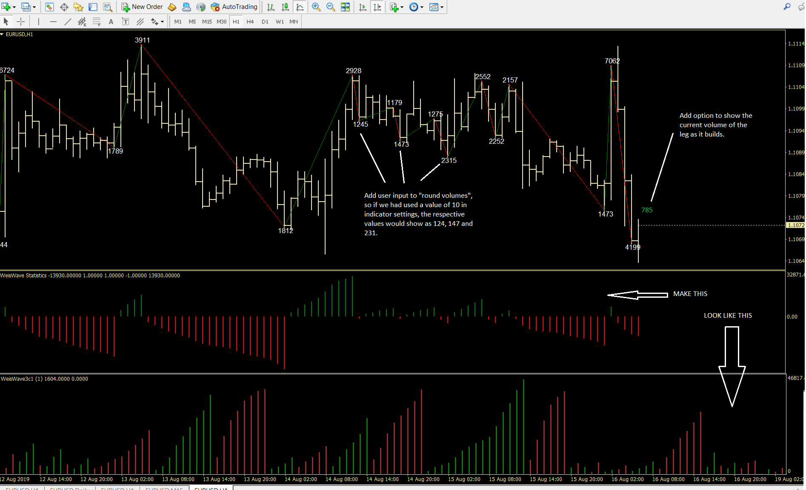
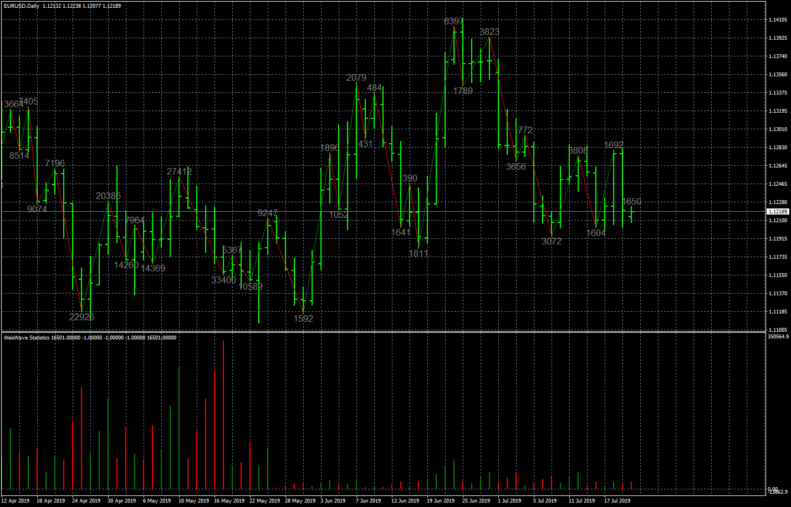

# Weis Wave Statistics

> Source: https://fxcodebase.com/code/viewtopic.php?f=38&t=67761  
> Forum: 38 · Topic 67761 · 18 post(s)

---

## Weis Wave Statistics

**Apprentice** · Thu Mar 21, 2019 3:43 pm

Based on request.
[viewtopic.php?f=27&t=67414](https://fxcodebase.com/code/viewtopic.php?f=27&t=67414)

 [Weis Wave Statistics.mq4](files/124839/Weis%20Wave%20Statistics.mq4)

---

## Re: Weis Wave Statistics

**logicgate** · Thu Aug 22, 2019 8:34 am

Hi there dear friend. I didn´t like the way the label was being displayed so I opened the file in metaeditor and adjusted. I have attached the file in this post so you can perform the mods described in the screenshot. Also, I would like to know what is the "absolute" option true or false in indi settings, could not figure that out. Regarding the percentages, you were not able to figure out how to display the percentages between the legs? Remember? For example if the previous leg had a volume of 1000, and the next leg had a volume of 1500, if the % option was set to "true", then it would plot 50% in green (cause we had a volume expansion). Now if the next leg had a volume of 800, the percentage plotted would be -47% plotted in red (cause we had volume shrinkage).

 [Weis Wave Statistics 1.1.mq4](files/128116/Weis%20Wave%20Statistics%201.1.mq4)

---

## Re: Weis Wave Statistics

**Apprentice** · Fri Aug 23, 2019 4:56 am

 [Weis Wave Statistics 1.2.mq4](files/128138/Weis%20Wave%20Statistics%201.2.mq4)

---

## Re: Weis Wave Statistics

**logicgate** · Fri Aug 23, 2019 8:45 am

Brilliant, gonna try it now.

---

## Re: Weis Wave Statistics

**logicgate** · Fri Aug 23, 2019 10:23 am

So we have some problems, I have attached an annotated screenshot.

We need to be able to choose the "volume now" label color to be different from the rest. Also, it needs to have a XY input to displace it a little bit, as of now it is too close to the bar.

The rounding of volume is being applied only to the total volume, you gonna have to add an option to apply the rounding either to the total or average. The comment about the values being plotted over each other was before I realized I could just set both total and average volume to false and I still would be able to see the rounded value, but we still need to be able to choose to each value we wanna apply the rounding.

Also, you haven´t told me what is the "absolute" parameter for, I tried true or false and saw no difference. And what about the percentages? Can´t you "tell the code" to grab the result of the volume calculation of the leg and compare to the previous one and apply a percentage calculation?

Best regards!

---

## Re: Weis Wave Statistics

**Apprentice** · Tue Aug 27, 2019 7:28 am

Your request is added to the development list.
 Internal developer reference 9.

---

## Re: Weis Wave Statistics

**Apprentice** · Tue Sep 03, 2019 5:03 am

[Weis Wave Statistics 1.3.mq4](files/128382/Weis%20Wave%20Statistics%201.3.mq4)

Try this version.

---

## Re: Weis Wave Statistics

**logicgate** · Tue Sep 03, 2019 7:48 am

Thanks! Gonna test it now

---

## Re: Weis Wave Statistics

**logicgate** · Tue Sep 03, 2019 10:08 am

Almost there, almost everything working perfectly with exception of the average volume percentages, they are totally incorrect (total volume percentages are correct, though)

---

## Re: Weis Wave Statistics

**Apprentice** · Thu Sep 05, 2019 5:34 am

Your request is added to the development list.
Development reference 40.

---

## Re: Weis Wave Statistics

**Apprentice** · Tue Sep 10, 2019 6:11 am

[Weis Wave Statistics 1.4.mq4](files/128527/Weis%20Wave%20Statistics%201.4.mq4)

Try this version.

---

## Re: Weis Wave Statistics

**ati5860** · Sat Oct 05, 2019 2:33 pm

is it maybe possible to implement an alert when the wave has changed from an upwave to a downwave. it could be great when it shows an alert after the candle that changes the wave has closed (so that we get noticed when the wave has really changed and doesnt show it by each possible change of a wave)????

thank you for your great work, i appreciate it)))

---

## Re: Weis Wave Statistics

**Apprentice** · Wed Oct 09, 2019 11:02 am

Your request is added to the development list.
Development reference 162.

---

## Re: Weis Wave Statistics

**Apprentice** · Thu Oct 10, 2019 12:45 pm

[Weis_Wave_Statistics_1.5.mq4](files/129121/Weis_Wave_Statistics_1.5.mq4)

Try this version.

---

## Re: Weis Wave Statistics

**Laurus12** · Sat Apr 26, 2025 9:18 am

> **Apprentice wrote:**
>
>
> Weis_Wave_Statistics_1.5.mq4
>
>
> Try this version.

Hello Apprentice!

First thank you very much for coding this indicator. Also, a bit nostalgic being back here on FXCodebase after almost thirteen years. Good memories.

I've tried out the indicator and it seems to be working very fine, but see that there is no way of setting the chart wave lines to "false". So I am wondering if it would be a huge task to add this option?

Best regards,
Laurus12

---

## Re: Weis Wave Statistics

**Apprentice** · Sat Apr 26, 2025 3:19 pm

We have added your request to the development list.
Development reference 284

---

## Re: Weis Wave Statistics

**Laurus12** · Sat Apr 26, 2025 3:51 pm

> **Apprentice wrote:**
> We have added your request to the development list.
> Development reference 284

Super! Thanks a lot Apprentice. Really appreciate it.

Laurus12

---

## Re: Weis Wave Statistics

**Apprentice** · Wed Apr 30, 2025 10:12 am

[Weis_Wave_Statistics_1.6.mq4](files/159094/Weis_Wave_Statistics_1.6.mq4)

Try this version.
