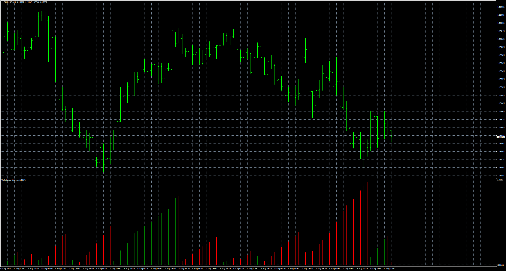
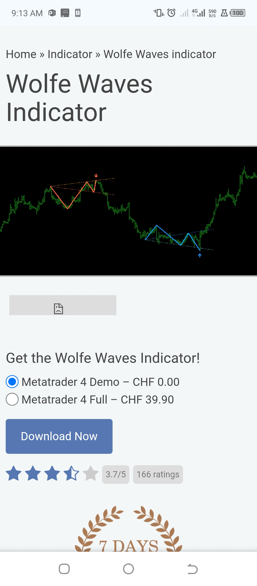
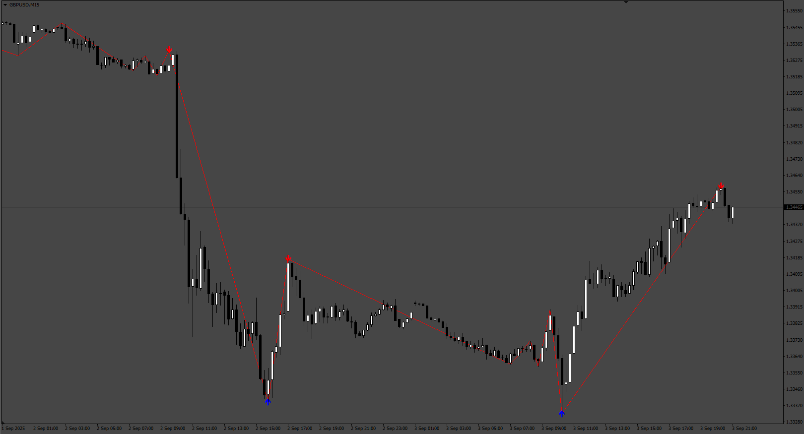

# Weis_Wave_Volume alert

> Source: https://fxcodebase.com/code/viewtopic.php?f=38&t=76208  
> Forum: 38 · Topic 76208 · 5 post(s)

---

## Weis_Wave_Volume alert

**Apprentice** · Mon Aug 04, 2025 3:22 am

Based on the request.
[https://fxcodebase.com/code/viewtopic.php?f=38&t=72062](https://fxcodebase.com/code/viewtopic.php?f=38&t=72062)

 [Weis_Wave_Volume alert.mq4](files/160109/Weis_Wave_Volume%20alert.mq4)

---

## Re: Weis_Wave_Volume alert

**marcelo2k9** · Sun Aug 24, 2025 4:50 am

Please Sir can u help us create this Indicator ? Mt5 thanks alot

---

## Re: Weis_Wave_Volume alert

**Apprentice** · Mon Aug 25, 2025 2:31 am

We have added your request to the development list.
Development reference 532

---

## Re: Weis_Wave_Volume alert

**Apprentice** · Fri Sep 05, 2025 3:27 am

 [Wolfe_Waves.mq4](files/160478/Wolfe_Waves.mq4)

---

## Re: Weis_Wave_Volume alert

**Asante** · Tue Sep 09, 2025 4:36 pm

> **Apprentice wrote:**
>
>
> 532.png
>
>
>
>
> Wolfe_Waves.mq4

Hi Mario, It seems the indicator is not showing anything in the chart.
