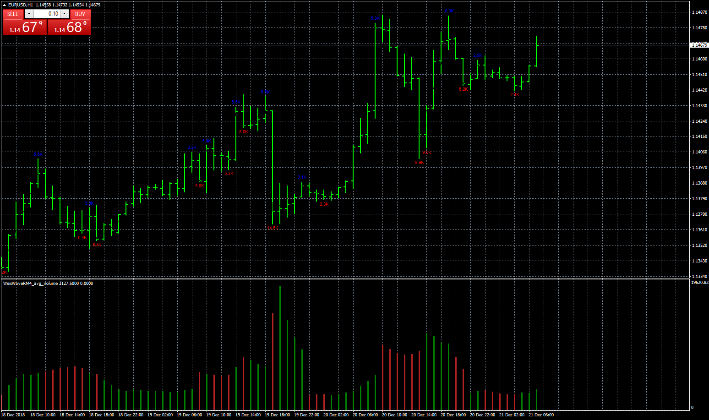

# WeisWave

> Source: https://fxcodebase.com/code/viewtopic.php?f=38&t=67182  
> Forum: 38 · Topic 67182 · 9 post(s)

---

## WeisWave

**Apprentice** · Thu Dec 20, 2018 1:51 pm

 [WeisWaveRM4.mq4](files/122962/WeisWaveRM4.mq4)

 [WeisWaveRM4_avg_volume.mq4](files/122962/WeisWaveRM4_avg_volume.mq4)

---

## Re: WeisWave

**logicgate** · Thu Dec 20, 2018 4:11 pm

Just would like to mention that, judging by the screenshot, the weis wave histogram is looking very weird.

---

## Re: WeisWave

**Apprentice** · Fri Dec 21, 2018 4:49 am

Try it now.

---

## Re: WeisWave

**Dors100** · Thu May 23, 2019 7:59 am

> **Apprentice wrote:**
>
>
> New.png
>
>
>
>
> WeisWaveRM4.mq4
>
>
>
>
> WeisWaveRM4_avg_volume.mq4

Hello!
I am writing via Google translator, so if that excuse me.
Can you add functions to this indicator like this?
[https://goo-gl.ru/5mfZ](https://goo-gl.ru/5mfZ)
1. Speed index, the calculation method is shown in the screenshot.
2. Change the order of the display parameters.
Thank!
[https://yadi.sk/i/0arVF5wnYbe5Sw](https://yadi.sk/i/0arVF5wnYbe5Sw)

---

## Re: WeisWave

**Apprentice** · Sat May 25, 2019 3:08 am

Your request is added to the development list under Id Number 4678

---

## Re: WeisWave

**Apprentice** · Mon May 27, 2019 6:46 am

[WeisWaveRM4.mq4](files/126565/WeisWaveRM4.mq4)

Try this version.

---

## Re: WeisWave

**Dors100** · Mon May 27, 2019 8:17 am

> **Apprentice wrote:**
>
>
> WeisWaveRM4.mq4
>
>
> Try this version.

Hello apprentice!
Thanks for the quick work.
But the updated indicator does not show anything.
[https://yadi.sk/i/1aO2M47FEbXGjg](https://yadi.sk/i/1aO2M47FEbXGjg)
 I did not find any new functions in the parameters. What could be the problem?
[https://yadi.sk/i/KLjsoDhLUNtyUg](https://yadi.sk/i/KLjsoDhLUNtyUg)

---

## Re: WeisWave

**Apprentice** · Wed May 29, 2019 3:47 am

[WeisWaveRM4.mq4](files/126601/WeisWaveRM4.mq4)

Try this version.

---

## Re: WeisWave

**Dors100** · Wed May 29, 2019 5:32 am

> **Apprentice wrote:**
>
>
> WeisWaveRM4.mq4
>
>
> Try this version.

I do not know, but nothing has changed. As it was in the original version and left
