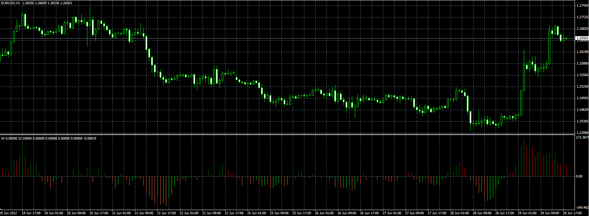

# WI oscillator

> Source: https://fxcodebase.com/code/viewtopic.php?f=38&t=20678  
> Forum: 38 · Topic 20678 · 1 post(s)

---

## WI oscillator

**Alexander.Gettinger** · Fri Jun 29, 2012 1:40 pm

Original indicator: [viewtopic.php?f=17&t=4966](https://fxcodebase.com/code/viewtopic.php?f=17&t=4966)

> WI is a Moving Average of (2*Close-High-Low).

 

Download:

 [Wi.mq4](files/36257/Wi.mq4)
