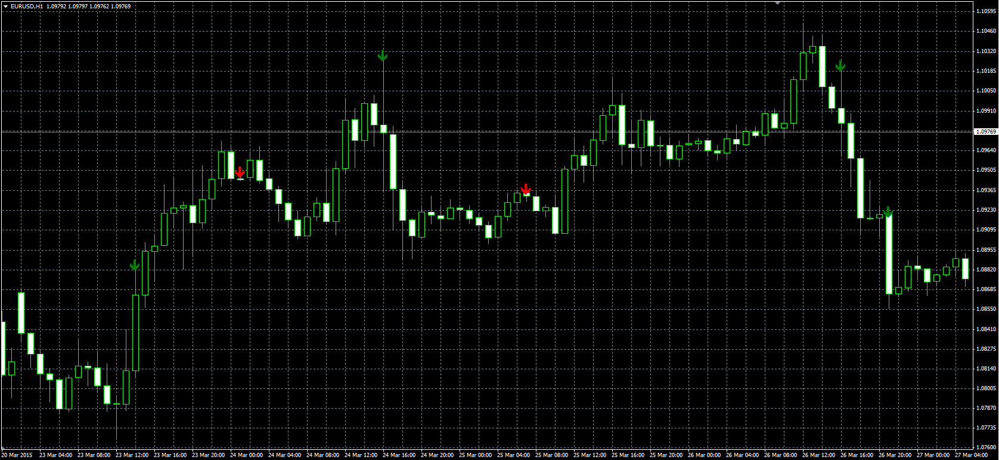

# Wide/Narrow Spread

> Source: https://fxcodebase.com/code/viewtopic.php?f=38&t=62168  
> Forum: 38 · Topic 62168 · 8 post(s)

---

## Wide/Narrow Spread

**Alexander.Gettinger** · Thu Apr 30, 2015 9:58 am

Original LUA indicator: [viewtopic.php?f=17&t=2255](https://fxcodebase.com/code/viewtopic.php?f=17&t=2255).

> Bar is Wide / Narrow if it's longest / shortest, measured from High to Low for the observed period.

 

Download:

 [Wide_Narrow_Spread.mq4](files/100172/Wide_Narrow_Spread.mq4)

---

## Re: Wide/Narrow Spread

**nookie** · Fri Aug 18, 2017 3:22 pm

Probably should be a new thread but is it possible an upgrade for an indicator with only High - Low for the spread, including the wicks of a candle? Example > eur/usd > High 1.4343 / Low 1.4330 > Value for indicator is 13 for the candle. Next candle High 1.4330 / Low 1.4320 > Value for indicator is 10 for the candle

---

## Re: Wide/Narrow Spread

**Apprentice** · Wed Aug 23, 2017 4:03 am

Your request is added to the development list, Under Id Number 3868
 If someone is interested to do this task, please contact me.

---

## Re: Wide/Narrow Spread

**Alexander.Gettinger** · Thu Aug 31, 2017 1:15 pm

> **nookie wrote:**
> Probably should be a new thread but is it possible an upgrade for an indicator with only High - Low for the spread, including the wicks of a candle? Example > eur/usd > High 1.4343 / Low 1.4330 > Value for indicator is 13 for the candle. Next candle High 1.4330 / Low 1.4320 > Value for indicator is 10 for the candle

Please, try this indicator.

Download:

 [HL_Range.mq4](files/114584/HL_Range.mq4)

---

## Re: Wide/Narrow Spread

**nookie** · Mon Sep 04, 2017 2:59 pm

Looks great I must say, thanks! Is there a possibility a Simple Moving Average to be added based on the indicator values ?

---

## Re: Wide/Narrow Spread

**Apprentice** · Mon Sep 04, 2017 7:26 pm

Average of HL_Range.mq4?

---

## Re: Wide/Narrow Spread

**nookie** · Tue Sep 05, 2017 2:14 am

Yes please

---

## Re: Wide/Narrow Spread

**Alexander.Gettinger** · Tue Sep 05, 2017 10:32 am

> **Apprentice wrote:**
> Average of HL_Range.mq4?

Indicator updated.
