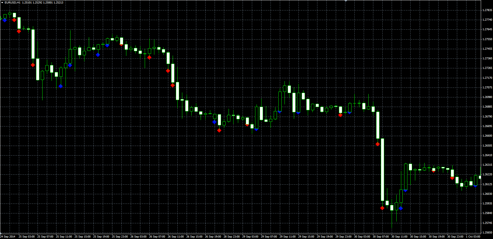

# Wide Range Body

> Source: https://fxcodebase.com/code/viewtopic.php?f=38&t=61475  
> Forum: 38 · Topic 61475 · 1 post(s)

---

## Wide Range Body

**Alexander.Gettinger** · Tue Nov 18, 2014 5:00 pm

Original LUA indicator: [viewtopic.php?f=17&t=14989](https://fxcodebase.com/code/viewtopic.php?f=17&t=14989).

> Wide Range Body is candles, whose body size is greater than body of previous three candles.
> However, this indicator has the possibility of using other periods, not only third.
> Distinguishes three types of WRB,
> n consecutive up candles,
> n consecutive down candles,
> series of n candles with different orientation.

 

Download:

 [WRB.mq4](files/97178/WRB.mq4)
