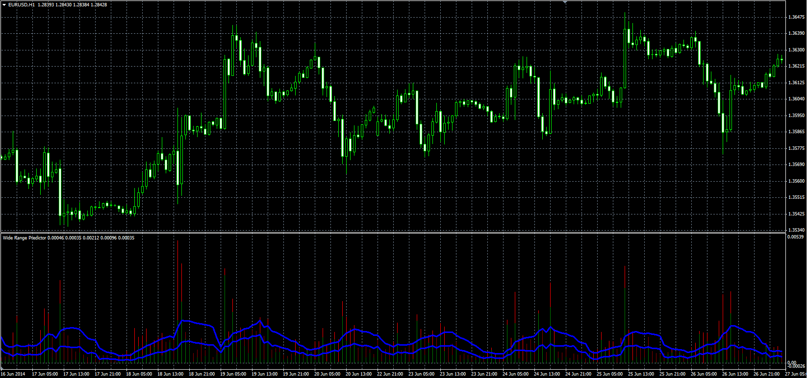

# Wide Range Predictor

> Source: https://fxcodebase.com/code/viewtopic.php?f=38&t=61252  
> Forum: 38 · Topic 61252 · 1 post(s)

---

## Wide Range Predictor

**Alexander.Gettinger** · Thu Sep 25, 2014 9:41 am

Original LUA oscillator: [viewtopic.php?f=17&t=27461](https://fxcodebase.com/code/viewtopic.php?f=17&t=27461).

Formulas:
RangeMA = MVA(Range),
BodyMA = MVA(Body), where
Range = High-Low,
Body = Abs(Close-Open),
Abs - absolute value.

 

Download:

 [WRP.mq4](files/96195/WRP.mq4)
