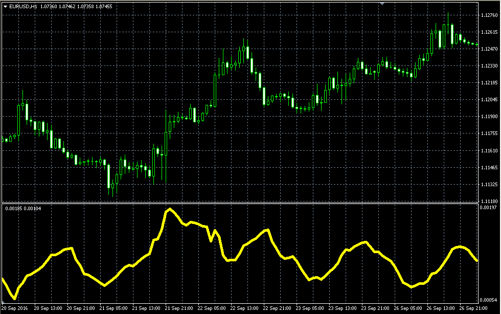

# Wilder ATR

> Source: https://fxcodebase.com/code/viewtopic.php?f=38&t=64344  
> Forum: 38 · Topic 64344 · 1 post(s)

---

## Wilder ATR

**Alexander.Gettinger** · Wed Jan 25, 2017 1:37 pm

Formula:
Wilder ATR=MA(TR) with [Length] number of periods and [Method] type, where
TR - true range,
TR is a maximum(hl, hc, lc),
hl[i] = High[i]-Low[i],
hc[i] = High[i]-Close[i-1],
lc[i] = Close[i-1]-Low[i].

 

Download:

 [Wilder_ATR.mq4](files/110710/Wilder_ATR.mq4)
