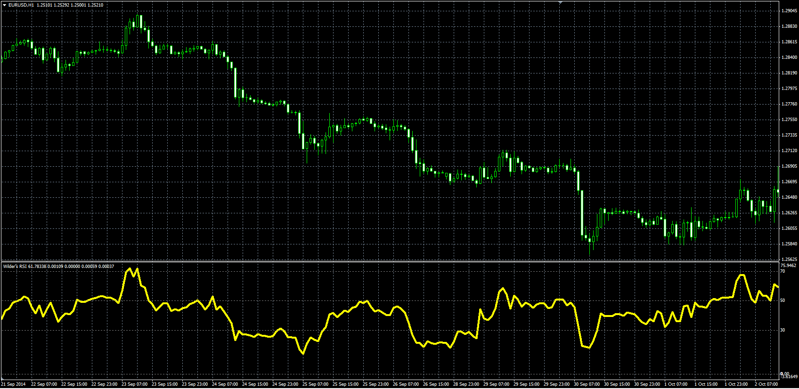

# Wilder's RSI

> Source: https://fxcodebase.com/code/viewtopic.php?f=38&t=61476  
> Forum: 38 · Topic 61476 · 1 post(s)

---

## Wilder's RSI

**Alexander.Gettinger** · Tue Nov 18, 2014 5:03 pm

Original LUA oscillator: [viewtopic.php?f=17&t=14923](https://fxcodebase.com/code/viewtopic.php?f=17&t=14923).

> The formula for calculation is identical to that used in the calculation of the RSI.
> Wilder's RSI, uses Wilder moving average for smoothing.

 

Download:

 [WRSI.mq4](files/97180/WRSI.mq4)
