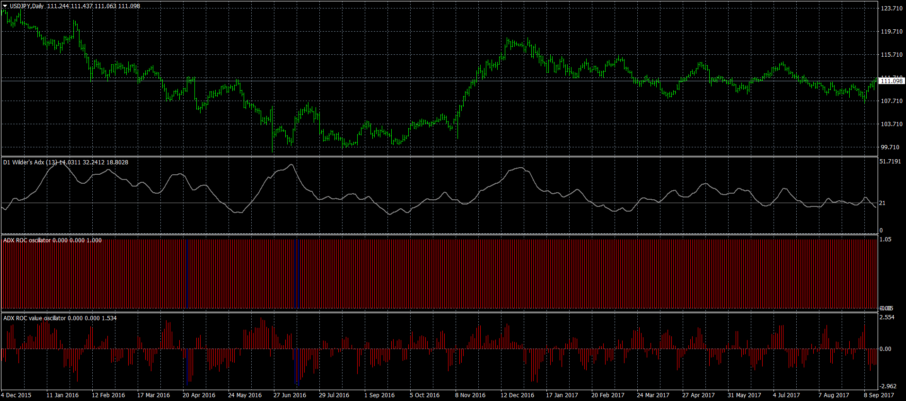
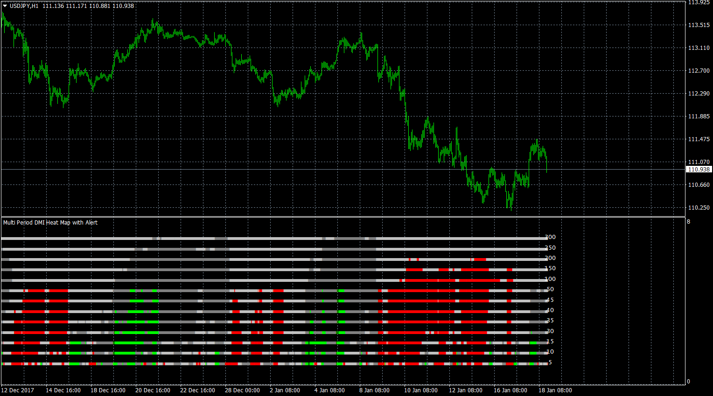

# Wilders_ADX_ROC_Oscillator

> Source: https://fxcodebase.com/code/viewtopic.php?f=38&t=65625  
> Forum: 38 · Topic 65625 · 14 post(s)

---

## Wilders_ADX_ROC_Oscillator

**Apprentice** · Fri Jan 12, 2018 6:18 am

Based on the request.
[viewtopic.php?f=38&t=61499](https://fxcodebase.com/code/viewtopic.php?f=38&t=61499)

 [Wilders DMI.mq4](files/116994/Wilders%20DMI.mq4)

 [Wilders_ADX_ROC_Oscillator.mq4](files/116994/Wilders_ADX_ROC_Oscillator.mq4)

 [Wilders_ADX_ROC_Value_Oscillator.mq4](files/116994/Wilders_ADX_ROC_Value_Oscillator.mq4)

 

For Wilders DMI, you'll need to install Wilders DMI indicator.

 [Multi Period DMI Heat Map with Alert.mq4](files/116994/Multi%20Period%20DMI%20Heat%20Map%20with%20Alert.mq4)

---

## Re: Wilders_ADX_ROC_Oscillator

**nookie** · Fri Jan 12, 2018 6:42 pm

Two things would be great to be there, alerts + ADX filter (if adx is less than 4 ADX ROC oscilator is providing no output) For the version Value_Oscillator.mq4. Is it possible ?

---

## Re: Wilders_ADX_ROC_Oscillator

**Apprentice** · Sat Jan 13, 2018 7:39 am

Your request is added to the development list under Id Number 4008

---

## Re: Wilders_ADX_ROC_Oscillator

**Apprentice** · Sun Jan 14, 2018 7:37 am

[Wilders_ADX_ROC_Value_Oscillator.nookie.mq4](files/117038/Wilders_ADX_ROC_Value_Oscillator.nookie.mq4)

Try this version.

For Wilders_ADX_ROC_Value_Oscillator.nookie, you'll need to install Wilders DMI indicator.

---

## Re: Wilders_ADX_ROC_Oscillator

**nookie** · Wed Jan 17, 2018 2:51 pm

Thanks! the messages "Fast, slow section" can they be a bit more descriptive like which fx pair or instrument it is about, what is the event triggering it etc.. also I am not sure if the 0,1,2 is the expected for those sections tirgger

 if (Absdiff>=Fast_Level)
 {
 Fast[pos]=diff;
 if (last_signal != 0)
 {
 doAlert("Fast section");
 last_signal = 0;
 }
 }
 else
 {
 if (Absdiff<=Slow_Level)
 {
 Slow[pos]=diff;
 if (last_signal != 1)
 {
 doAlert("Slow section");
 last_signal = 1;
 }
 }
 else
 {
 Moderate[pos]=diff;
 if (last_signal != 2)
 {
 doAlert("Moderate section");
 last_signal = 2;

---

## Re: Wilders_ADX_ROC_Oscillator

**Apprentice** · Thu Jan 18, 2018 11:40 am

[Wilders_ADX_ROC_Value_Oscillator.nookie.mq4](files/117128/Wilders_ADX_ROC_Value_Oscillator.nookie.mq4)

Try this version.

For Wilders_ADX_ROC_Value_Oscillator.nookie, you'll need to install Wilders DMI indicator.

---

## Re: Wilders_ADX_ROC_Oscillator

**Apprentice** · Thu Jan 18, 2018 11:48 am

Multi Period DMI Heat Map with Alert.mq4 added.

---

## Re: Wilders_ADX_ROC_Oscillator

**nookie** · Thu Jan 18, 2018 2:28 pm

Looks good the heat map, thanks, though tough a bit to know which value is for which setting,I can see only Lenght1,2,3,4,.. and shouldnt it be ?

case PERIOD_M1:
 return "M1";
 case PERIOD_M5:
 return "M5";
 case PERIOD_D1:
 return "D1";
 case PERIOD_H1:
 return "H1";
 case PERIOD_H4:
 return "H4";
 case PERIOD_M15:
 return "M15";
 case PERIOD_M30:
 return "M30";
 case PERIOD_MN1:
 return "MN1";
 case PERIOD_W1:
 return "W1";

---

## Re: Wilders_ADX_ROC_Oscillator

**nookie** · Tue Jan 30, 2018 5:21 pm

All versions are generating too many alerts, 1 alert every minute on 15M chart.. not sure why though. can they generate alert only when a candle is drawn and complete and state is changed ? And also alerts only should be triggered when into Fast section

---

## Re: Wilders_ADX_ROC_Oscillator

**nookie** · Tue Jan 30, 2018 5:24 pm

Ideally alert displayed with a value like "#EURUSD. (M5):Fast section = 4.68"
is it possible ?

---

## Re: Wilders_ADX_ROC_Oscillator

**Apprentice** · Wed Jan 31, 2018 5:21 am

[Wilders_ADX_ROC_Value_Oscillator.nookie.mq4](files/117365/Wilders_ADX_ROC_Value_Oscillator.nookie.mq4)

For Wilders_ADX_ROC_Value_Oscillator.nookie, you'll need to install Wilders DMI indicator.

---

## Re: Wilders_ADX_ROC_Oscillator

**nookie** · Wed Jan 31, 2018 5:30 am

I have it installed already, thanks

---

## Re: Wilders_ADX_ROC_Oscillator

**nookie** · Fri Jun 08, 2018 2:08 pm

Much appreciated the help Apprentice!

Though the alerting seems not working I think as expected, I am not sure how to interpret my ideas in coding but ideally a slight change is needed which help is needed please.

My logic can be formulated as below, hope it makes sense

Alerting on Fast_Level only when >2

extern double Fast_Level=2;
extern bool alertsOn = true;
extern int alertsLevel = 2;

 if ( Fast_Level => alertsLevel )

then doAlert("Fast section");

---

## Re: Wilders_ADX_ROC_Oscillator

**nookie** · Fri Jun 08, 2018 2:09 pm

My post was for the Wilders_ADX_ROC_Value_Oscillator.nookie.mq4
