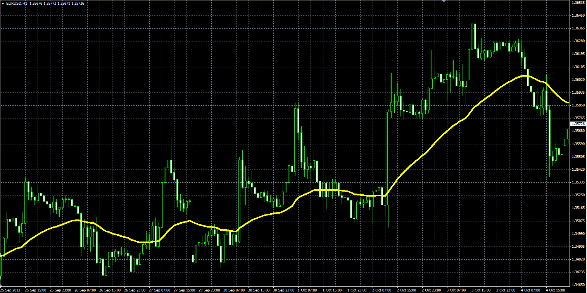

# Wilders smooting average (WMA)

> Source: https://fxcodebase.com/code/viewtopic.php?f=38&t=59621  
> Forum: 38 · Topic 59621 · 4 post(s)

---

## Wilders smooting average (WMA)

**Alexander.Gettinger** · Tue Oct 08, 2013 11:53 am

Formulas:
WMA[i] = (Price[i] - WMA[i-1])*k + WMA[i-1], where
k = 1/Length.

 

Download:

 [WMA.mq4](files/89894/WMA.mq4)

---

## Re: Wilders smooting average (WMA)

**sagymmm** · Mon Oct 06, 2014 9:13 pm

Hi, can we let the indicator make a sound alert and send email when candle closes above or below it?

---

## Re: Wilders smooting average (WMA)

**Apprentice** · Tue Oct 07, 2014 11:06 am

Your request is added to the development list.

---

## Re: Wilders smooting average (WMA)

**Alexander.Gettinger** · Fri Feb 22, 2019 2:49 pm

Please try this indicator:

 [WMA_with_Alert.mq4](files/124075/WMA_with_Alert.mq4)
