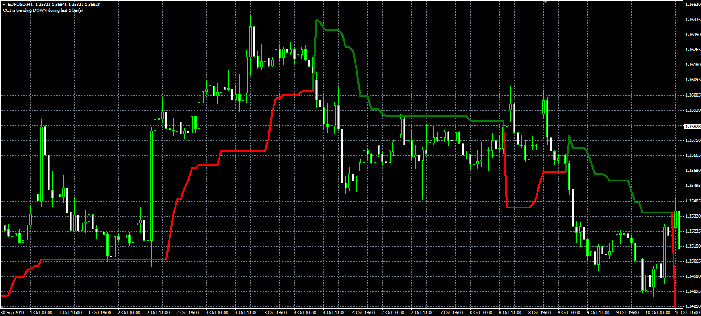
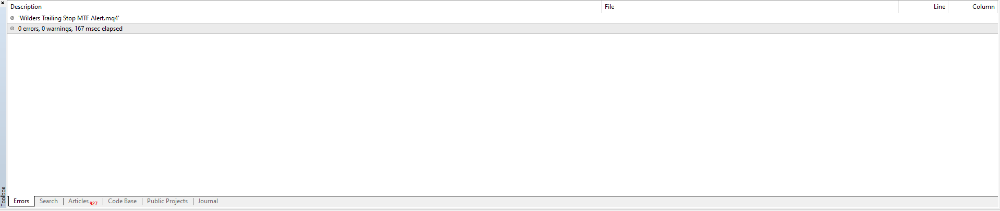
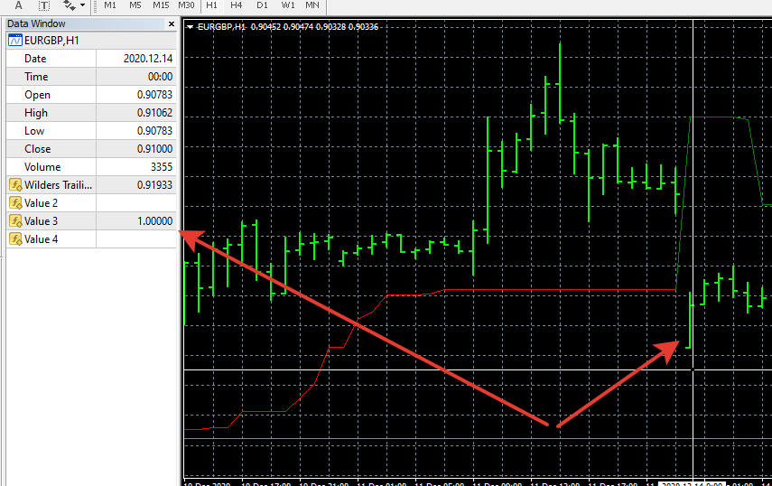
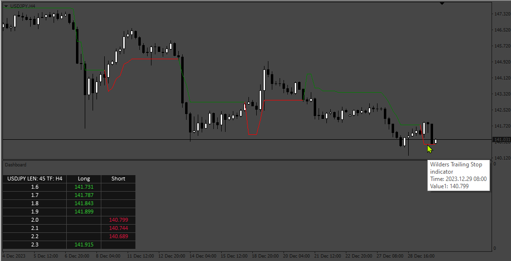

# Wilders Trailing Stop indicator

> Source: https://fxcodebase.com/code/viewtopic.php?f=38&t=60029  
> Forum: 38 · Topic 60029 · 45 post(s)

---

## Wilders Trailing Stop indicator

**Alexander.Gettinger** · Fri Nov 29, 2013 3:39 pm

Original LUA indicator: [viewtopic.php?f=17&t=60028](https://fxcodebase.com/code/viewtopic.php?f=17&t=60028).

Formulas:
WTS[i] = Max(WTS[i-1], Close[i]-loss), if Close[i]>WTS[i-1] and Close[i-1]>WTS[i-1],
WTS[i] = Min(WTS[i-1], Close[i]+loss), if Close[i]<WTS[i-1] and Close[i-1]<WTS[i-1],
WTS[i] = Close[i]-loss, if Close[i]>WTS[i-1],
WTS[i] = Close[i]+loss, in other cases, where
loss = Coeff*ATR,
ATR - Average True Range with Period.

 

Download:

 [Wilders_Trailing_Stop.mq4](files/91251/Wilders_Trailing_Stop.mq4)

 [Wilders_Trailing_Stop_MTF.mq4](files/91251/Wilders_Trailing_Stop_MTF.mq4)

 [Wilders_Trailing_Stop_dashboard.mq4](files/91251/Wilders_Trailing_Stop_dashboard.mq4)

 [Wilders Trailing Stop MTF Alert.mq4](files/91251/Wilders%20Trailing%20Stop%20MTF%20Alert.mq4)

---

## Re: Wilders Trailing Stop indicator

**Apprentice** · Mon Nov 03, 2014 5:29 am

A.K.A. Average True Range Trailing Stops

---

## Re: Wilders Trailing Stop indicator

**sathistrader** · Wed Mar 07, 2018 11:22 am

**can you make mtf for this indicator (including custom time frame to use in offline chart)**

---

## Re: Wilders Trailing Stop indicator

**Apprentice** · Fri Mar 09, 2018 6:32 am

Your request is added to the development list under Id Number 4066

---

## Re: Wilders Trailing Stop indicator

**Apprentice** · Tue Mar 13, 2018 6:03 am

Wilders_Trailing_Stop_MTF added.
Did you mean a multi-timeframe dashboard?

---

## Re: Wilders Trailing Stop indicator

**Apprentice** · Thu Mar 15, 2018 2:04 pm

Wilders_Trailing_Stop_dashboard.mq4 added.

---

## Re: Wilders Trailing Stop indicator

**evansrono** · Sun Jun 28, 2020 10:28 am

Hi,

Could the Wilders Trailing Stop MTF indicator have alert notification options(sound,email,phone) whereby, a change of direction in the current (eg.H1) timeframe AND close of the lower timeframe (M15) candle in that direction creates an alert.

---

## Re: Wilders Trailing Stop indicator

**Apprentice** · Mon Jun 29, 2020 7:13 am

Your request is added to the development list.
Development reference 1584.

---

## Re: Wilders Trailing Stop indicator

**Apprentice** · Tue Jun 30, 2020 3:59 am

Wilders Trailing Stop MTF Alert.mq4 added.

---

## Re: Wilders Trailing Stop indicator

**evansrono** · Tue Jun 30, 2020 5:28 am

Well.. that was fast. Thankyou Apprentice.

---

## Re: Wilders Trailing Stop indicator

**evansrono** · Tue Jun 30, 2020 5:36 am

Hi Apprentice,
I'm getting these two errors:

'}' - expressions are not allowed on a global scope 1034
 not all control paths return a value	1032

Regards

---

## Re: Wilders Trailing Stop indicator

**Apprentice** · Tue Jun 30, 2020 8:54 am

Your request is added to the development list.
Development reference 1597.

---

## Re: Wilders Trailing Stop indicator

**Apprentice** · Wed Jul 01, 2020 4:11 am

Fixed.

---

## Re: Wilders Trailing Stop indicator

**evansrono** · Wed Jul 01, 2020 5:13 am

Hi,

Thankyou for your response. Received the errors below:

'return' - expressions are not allowed on a global scope	1033	4
'}' - expressions are not allowed on a global scope 1034	1
not all control paths return a value 1032	4

Regards

---

## Re: Wilders Trailing Stop indicator

**Apprentice** · Wed Jul 01, 2020 10:47 am

Can you name the indicator?

If you have problems with Wilders Trailing Stop MTF Alert.mq4

 

you probably have an old version of file in your browser buffer.

---

## Re: Wilders Trailing Stop indicator

**evansrono** · Sun Jul 05, 2020 7:41 am

Hi Apprentice,

Thanks. Sorted the browser buffer issue then I tried to start/ run it, but I'm getting a green line above the candles.

Regards.

---

## Re: Wilders Trailing Stop indicator

**Apprentice** · Sun Jul 05, 2020 1:13 pm

Your request is added to the development list.
Development reference 1633.

---

## Re: Wilders Trailing Stop indicator

**Apprentice** · Mon Jul 06, 2020 2:01 pm

I don't see any issues with this indicator.
Or I do no understand what the issue is, and how indicator needs to look like.

---

## Re: Wilders Trailing Stop indicator

**evansrono** · Tue Jul 07, 2020 3:39 am

Hi,

I needed it to look the same as the 'Wilders Trailing Stop MTF' on screen but with the alerts requested. eg. when this Wilder indicator on the H4 turns, ie price goes long and indicator turns down and vice versa, the first H1 candle to close while H4 indicator(WTS) is in this new direction creates an alert.

Regards.

---

## Re: Wilders Trailing Stop indicator

**Apprentice** · Thu Jul 09, 2020 4:46 am

[Wilders Trailing Stop MTF Alert.mq4](files/135785/Wilders%20Trailing%20Stop%20MTF%20Alert.mq4)

Try this version.

---

## Re: Wilders Trailing Stop indicator

**evansrono** · Fri Jul 10, 2020 6:24 am

Hi,

 It works fine. Appreciate your work. BIG THANKYOU!!

Regards

---

## Re: Wilders Trailing Stop indicator

**sonychen59** · Fri Nov 27, 2020 12:00 pm

Hi,

The "Wilders_Trailing_Stop_MTF" indicator shows the entry on chart very almost correctly.

If I create an EA with this indicator, that will be great.
But I try to get this indicator's return values and figure it out as a rule for entry,
the rule is not good exactly.

Would you make this indicator return 1 for buy entry and -1 for sell entry?

 I appreciate it.

P.S.:
The indicator returns two values.
My rule is:
Buy entry => 1st value = 1800.12, 2nd value = 1800.12
Sell entry => 1st value = 1800.12, 2nd value = 2147483647

---

## Re: Wilders Trailing Stop indicator

**sonychen59** · Fri Nov 27, 2020 2:02 pm

> **Alexander.Gettinger wrote:**
> Original LUA indicator: [viewtopic.php?f=17&t=60028](https://fxcodebase.com/code/viewtopic.php?f=17&t=60028).
>
> Formulas:
> WTS[i] = Max(WTS[i-1], Close[i]-loss), if Close[i]>WTS[i-1] and Close[i-1]>WTS[i-1],
> WTS[i] = Min(WTS[i-1], Close[i]+loss), if Close[i]<WTS[i-1] and Close[i-1]<WTS[i-1],
> WTS[i] = Close[i]-loss, if Close[i]>WTS[i-1],
> WTS[i] = Close[i]+loss, in other cases, where
> loss = Coeff*ATR,
> ATR - Average True Range with Period.
>
>
>
> Wilders_Trailing_Stop_MQL.PNG
>
>
>
> Download:
>
>
> Wilders_Trailing_Stop.mq4
>
>
>
>
> Wilders_Trailing_Stop_MTF.mq4
>
>
>
>
> Wilders_Trailing_Stop_dashboard.mq4
>
>
>
>
> Wilders Trailing Stop MTF Alert.mq4

Dear Sir,

Could you make these indicators return 1 for 'Buy' and -1 for 'Sell' ?

---

## Re: Wilders Trailing Stop indicator

**Apprentice** · Sun Nov 29, 2020 3:13 am

Your request is added to the development list.
Development reference 2371.

---

## Re: Wilders Trailing Stop indicator

**Apprentice** · Mon Nov 30, 2020 10:34 am

Why do you need that? To use in EA?
 Wilders Trailing Stop MTF Alert.mq4 does have two streams for that: up and down

---

## Re: Wilders Trailing Stop indicator

**sonychen59** · Sat Dec 05, 2020 1:37 pm

> **Apprentice wrote:**
> Why do you need that? To use in EA?
> Wilders Trailing Stop MTF Alert.mq4 does have two streams for that: up and down

Hi, Sir,

The "Wilders Trailing Stop MTF Alert.mq4" seems to work not well as below shown:

---

## Re: Wilders Trailing Stop indicator

**Apprentice** · Sun Dec 06, 2020 6:47 am

Can you elaborate on what's wrong?

---

## Re: Wilders Trailing Stop indicator

**sonychen59** · Sun Dec 06, 2020 7:29 am

> **Apprentice wrote:**
> Can you elaborate on what's wrong?

Hi Sir,

The "Wilders Trailing Stop MTF Alert" indicator with default value on the chart is floating over the K bars.

Is it normal?

---

## Re: Wilders Trailing Stop indicator

**sonychen59** · Sun Dec 06, 2020 9:10 am

> **Apprentice wrote:**
> Can you elaborate on what's wrong?

Hi Sir,

The picture shows the "Wilders Trailing Stop MTF Alert" and "Wilders Trailing Stop MTF" indicators on the chart.

The "Wilders Trailing Stop MTF" indicator can tell the trend
but the "Wilders Trailing Stop MTF Alert" not.

The "Wilders Trailing Stop MTF Alert" indicator is always above the K bars.
The "Wilders Trailing Stop MTF" indicator shows Blue and below the K bars for Trend Up,
then shows Yellow and above the K bars for Trend Down.

---

## Re: Wilders Trailing Stop indicator

**Apprentice** · Wed Dec 09, 2020 5:31 am

I don't have any difference between these two indicators.
They both show the same values

---

## Re: Wilders Trailing Stop indicator

**sonychen59** · Wed Dec 09, 2020 12:38 pm

> **Apprentice wrote:**
> I don't have any difference between these two indicators.
> They both show the same values

The attached picture shows the two indicators, one is always above the K bar and another works fine.

How about add two buffers for the "Wilders Trailing Stop MTF" indicator to
return 1 for Buy and -1 for Sell?

I appreciate your help.

---

## Re: Wilders Trailing Stop indicator

**Apprentice** · Thu Dec 10, 2020 5:40 am

Your request is added to the development list.
Development reference 2435.

---

## Re: Wilders Trailing Stop indicator

**Apprentice** · Sat Dec 12, 2020 7:37 am

[Wilders_Trailing_Stop_MTF_signals.mq4](files/139495/Wilders_Trailing_Stop_MTF_signals.mq4)

Try this version.

---

## Re: Wilders Trailing Stop indicator

**sonychen59** · Mon Dec 14, 2020 12:08 pm

> **Apprentice wrote:**
>
>
> Wilders_Trailing_Stop_MTF_signals.mq4
>
>
> Try this version.

Thank you Sir.

I've tested and recorded the returned values.

I found that the "1 for Up and -1 for Down" cannot specify the buy/sell entry exactly.

I tested the indicator in 1 minute timeframe.
the settings are as below:
Length = 13;// => seems to be not necessary
Coeff = 0;
TimeFrame = 0;

Would you check the two buffers (up_signal/down_signal)to get exact values?
or what's the logic of the two buffers?

Very thank your help!

---

## Re: Wilders Trailing Stop indicator

**Apprentice** · Tue Dec 15, 2020 11:30 am

Your request is added to the development list.
Development reference 2469.

---

## Re: Wilders Trailing Stop indicator

**Apprentice** · Wed Dec 16, 2020 9:53 am

I don't understand what needs to be done. It works

---

## Re: Wilders Trailing Stop indicator

**sonychen59** · Wed Dec 16, 2020 9:21 pm

> **Apprentice wrote:**
>
>
> image.png
>
>
> I don't understand what needs to be done. It works

Dear Sir,

Yes, the indicator did return 1 or -1, but it is randomly.
(It almost returns 1. )

According to the following settings in 1 minute timeframe (just for test quickly):
Length = 13;
Coeff = 0;
TimeFrame = 0;

When the indicator returns 1, it means BUY,
returns -1, it means SELL.
It should be as the attached picture shown:

---

## Re: Wilders Trailing Stop indicator

**sonychen59** · Thu Dec 17, 2020 11:11 pm

> **Apprentice wrote:**
>
>
> image.png
>
>
> I don't understand what needs to be done. It works

Dear Sir,

I'd written a message several days ago.
I don't know why the fxcodebase usually ignored to confirm or skip my messages.
So, I send the messages again:

The indicator returns 1 for BUY and -1 for SELL indeed,
but not always.

It always returns 1 and sometimes returns -1.

If the signals are correct, it should be as the picture:

Thank your help.

---

## Re: Wilders Trailing Stop indicator

**Apprentice** · Fri Dec 18, 2020 5:15 am

Your request is added to the development list.
Development reference 2491.

---

## Re: Wilders Trailing Stop indicator

**Apprentice** · Mon Dec 21, 2020 2:44 am

I don't have any issues. It returns 1/-1 on every color change

---

## Re: Wilders Trailing Stop indicator

**sonychen59** · Mon Dec 21, 2020 8:47 am

> **Apprentice wrote:**
> I don't have any issues. It returns 1/-1 on every color change

Really?

Maybe "shift 0" is too sensitive. I'll change the "shift 0" to "shift 1".
But it might not optimistic because the indicator always returns 1 and sometimes returns -1.

Thank you!

---

## Re: Wilders Trailing Stop indicator

**evansrono** · Mon Nov 07, 2022 9:56 am

Hi,

For the Wilder Trailing Stop Dashboard, please change criteria to show long & short stops together as follows:

1.	Short Stop Line – Green
Show the figures in Green
Column - Change the Currency Pair column to show current timeframe 8 coefficients inputs
Row – Add current timeframe 1 length input for all eight coefficients.
Ie. One length input with eight different coefficient outputs.

2.	Long Stop Line – Red
Show the Figures in Red
Column – Change the Currency Pair column to show current timeframe 8 coefficients inputs
Row – Add current timeframe 1 length input for all eight coefficients.
Ie. One length input with eight different coefficient outputs.

Dashboard should show figures at closed timeframe candle. eg. H4 output figure should be for closed H4 Candle. See image below.

[https://postimg.cc/dLgQXrKQ](https://postimg.cc/dLgQXrKQ)

---

## Re: Wilders Trailing Stop indicator

**Apprentice** · Sun Nov 13, 2022 4:31 am

We have added your request to the development list.
Development reference 746.

---

## Re: Wilders Trailing Stop indicator

**evansrono** · Tue Feb 07, 2023 4:23 am

Hi,

Any progress?

Regards

---

## Re: Wilders Trailing Stop indicator

**Apprentice** · Wed Jan 03, 2024 5:32 am

 [Wilders_Trailing_Stop_dashboard_v2.mq4](files/153909/Wilders_Trailing_Stop_dashboard_v2.mq4)
