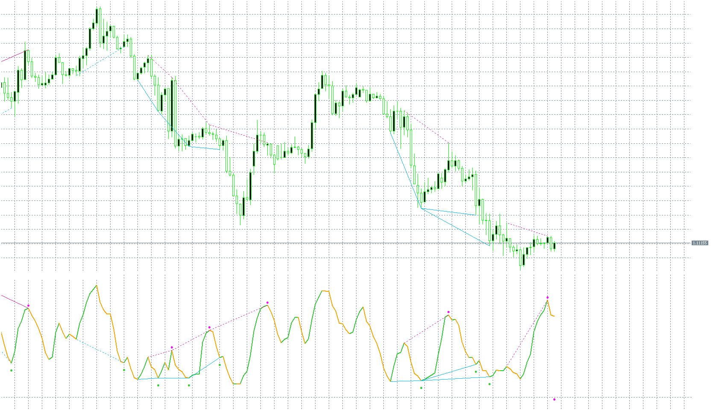

# wildhog-indicator

> Source: https://fxcodebase.com/code/viewtopic.php?f=38&t=70184  
> Forum: 38 · Topic 70184 · 4 post(s)

---

## wildhog-indicator

**Apprentice** · Thu Jul 16, 2020 5:47 am

Based on request.
[viewtopic.php?f=27&t=70163](https://fxcodebase.com/code/viewtopic.php?f=27&t=70163)

 [wildhog-indicator.mq5](files/136026/wildhog-indicator.mq5)

---

## Re: wildhog-indicator

**spidernet57** · Mon Sep 07, 2020 6:44 am

WILDHOG INDICATOR WAS MT4
YOU ARE CONVERT IT TO MT5
BUT ARE YOU SEE ON CHART
I DON.T KNOW WHY
PLEASE CAN YOU HELP
THANK YOU SO MUCH BROTHER

---

## Re: wildhog-indicator

**Apprentice** · Tue Sep 08, 2020 2:57 am

Your request is added to the development list.
Development reference 1993.

---

## Re: wildhog-indicator

**Apprentice** · Thu Sep 10, 2020 2:09 am

Try it now.
